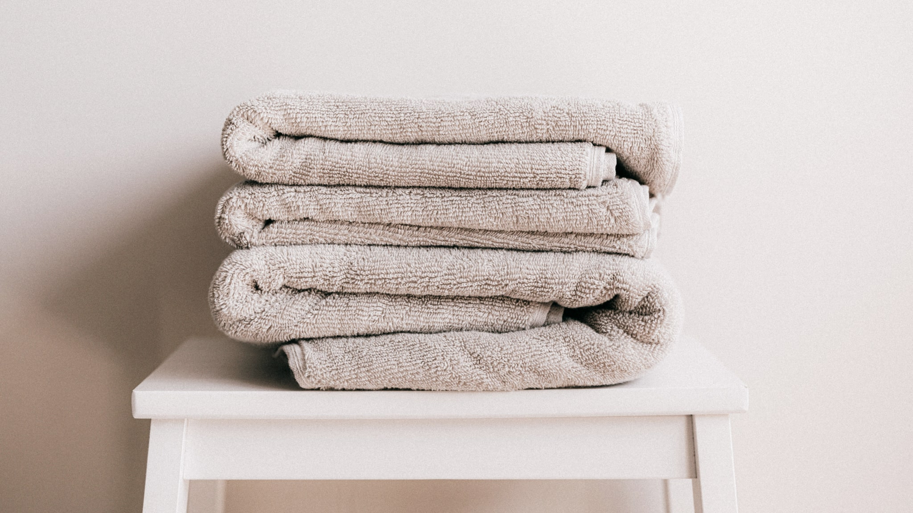

Als je ooit een Koreaanse routine hebt opgezocht, ben je hier vast over gestruikeld: je begint niet met wassen, je begint met olie. Daarna pas komt er water bij. Twee stappen dus, voordat je überhaupt aan de rest toekomt.

Het klinkt als een stap te veel in een routine die toch al lang is. En eerlijk: soms is het dat ook. Maar er zit een simpele scheikundige gedachte achter, en als je die eenmaal snapt, kun je zelf bepalen wanneer je het doet en wanneer je het overslaat.

## Waarom water alleen niet alles meeneemt

Het principe is iets dat je uit je keuken kent. Vet en water mengen niet. Je kunt een koekenpan waar reuzel in heeft gezeten onder de kraan houden zolang je wilt, er blijft een dof laagje achter tot je er zeep of iets vettigs bij haalt.

Op je gezicht speelt hetzelfde. Een deel van wat er op je huid ligt is in water oplosbaar: zweet, stof, een groot deel van het straatvuil. Dat gaat met water en een gewone reiniger prima weg. Maar een ander deel is dat niet. Zonnebrand is er berucht om, zeker de watervaste varianten, want die zijn er letterlijk op gemaakt om níét met water weg te spoelen. Datzelfde geldt voor langhoudende foundation, waterproof mascara en het talg dat je huid zelf de hele dag aanmaakt.

Voor dat tweede deel gebruik je iets vettigs: een reinigingsolie, een balm die bij lichaamstemperatuur smelt, of een micellair product. Olie lost op wat olie-achtig is. Dat is de hele truc, geen magie, gewoon oplosbaarheid.

De tweede stap, met een schuimende of gelachtige reiniger op waterbasis, haalt vervolgens weg wat er van die olie op je huid is achtergebleven, samen met het water-oplosbare deel. Vandaar de volgorde: eerst het vettige, dan het waterige. Andersom werkt het niet, want dan smeer je je olie over een al natte huid en pakt hij minder.

## Waar de gewoonte vandaan komt

Dubbel reinigen wordt vaak als een Koreaanse uitvinding gepresenteerd, maar dat is het niet helemaal. Het idee is ouder en komt uit een hoek waar je het misschien niet zoekt: de professionele schmink. Wie voor het toneel of de camera een dikke laag make-up op heeft gehad, haalt die er al een eeuw lang af met een vettige crème, en wast daarna pas met water. In Japan bestaat de reinigingsolie als productcategorie ook al decennia.

Wat Korea eraan heeft toegevoegd is dat het van een specialistische handeling een dagelijkse gewoonte werd, met een eigen woordenschat en een eigen plek in de volgorde. En daar zit meteen de reden dat het bij ons zo hard is aangeslagen: het is uit te leggen. Een routine met tien stappen waarvan je er negen niet begrijpt, houdt niemand vol. Twee stappen met een logische reden erachter wel.

## Wanneer je het gerust kunt overslaan

Hier wordt het praktisch, want dubbel reinigen is geen wet.

De vuistregel die je kunt aanhouden: **hoeveel moet er af?** Heb je een dag met zonnebrand, make-up, of allebei achter de rug, dan is er een olie-achtige stap die werk verzet. Was het een dag thuis, zonder make-up en zonder zon, dan is er weinig om op te lossen en is één reiniging genoeg.

's Ochtends geldt dat des te meer. In je slaap is er niets op je gezicht gekomen behalve wat je huid zelf heeft aangemaakt en misschien de restanten van je nachtcrème. Veel mensen slaan de ochtendreiniging daarom helemaal over en spoelen alleen met water. Dat is geen luiheid maar een verdedigbare keuze, en als je huid 's ochtends strak aanvoelt na het wassen, is het waarschijnlijk zelfs de prettigere.

Een tweede kanttekening: dubbel doen betekent niet twee keer stevig boenen. De handeling is kort en zonder kracht. Je masseert de olie een halve minuut over een droge huid, je emulgeert hem met een beetje lauw water tot hij melkachtig wordt, en dan spoel je. Water dat te heet is voelt op dat moment fijn en is achteraf zelden een goed idee.

## Waar je op een etiket naar kunt kijken

In de eerste stap zie je meestal een plantaardige olie hoog in de lijst staan, zonnebloem, jojoba, olijf, camellia, samen met een emulgator. Die emulgator is het onderdeel dat ervoor zorgt dat de olie met water melkachtig wordt en zich laat wegspoelen; zonder dat blijft er een filmpje achter.

In de tweede stap kom je vaak een zogeheten surfactant tegen. Dat is de verzamelnaam voor de stoffen die water "natter" maken en vuil meenemen. Sommige daarvan staan bekend als pittig, je ziet ze terug in producten die veel schuim geven. Anderen doen dat nauwelijks. Weinig schuim betekent niet dat een reiniger niets doet; schuim is grotendeels een kwestie van welke surfactant er gekozen is, niet van hoe grondig het wordt.

Wat je op een Europees etiket níét zult zien, is een belofte over wat de reiniging met je huid dóét. Dat is geen bescheidenheid van het merk maar wetgeving: een cosmetisch product mag beschrijven wat het is en wat het opruimt, maar geen werking claimen die in medisch gebied ligt. Wie dat weet, leest een verpakking meteen anders, en merkt hoe vaak de tekst op de voorkant iets suggereert wat er in de kleine lettertjes nergens staat.

## Kort samengevat

Twee stappen, met een reden: het eerste product pakt wat vettig is, het tweede wat waterig is. Op een dag met zonnebrand of make-up verzet die eerste stap echt werk. Op een dag zonder is één keer prima. En 's ochtends mag het bij water blijven, als dat voor jou lekkerder voelt.
