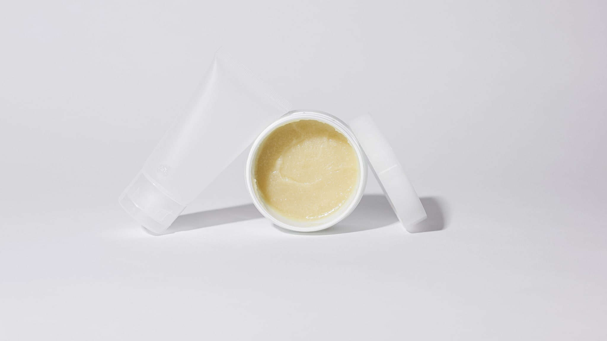

Je hebt vier potjes op de rand van je wastafel staan en geen idee welke er eerst op moet. Dat is niet gek: op de verpakkingen staat het zelden, en online krijg je routines voorgeschoteld met zeven tot twaalf stappen waarin de logica ergens onderweg zoekraakt.

Het goede nieuws is dat er één regel is waarmee je bijna alles zelf kunt uitzoeken.

## De regel: van dun naar dik

Breng op wat het meest waterig is, en werk toe naar wat het dikst is. Een toner is bijna water; die gaat als eerste. Een essence is iets stroperiger. Een serum is dikker dan dat. Een crème is het dikst en gaat als laatste, of op één na laatste, want overdag komt de zonnebrand daar nog achteraan.

De reden erachter is even simpel als de regel zelf. De dikkere producten in een routine bevatten meestal ingrediënten die op de huid blijven liggen in plaats van erin te trekken: plantaardige oliën, boters, siliconen, wassen. Precies díé stoffen vormen een laagje dat waterige producten maar moeilijk passeren. Smeer je eerst je dikste crème en daarna je waterige toner, dan blijft die toner voor een deel op dat laagje liggen.

Andersom werkt het wel. Water trekt vlot in, en wat daarna komt legt zich er overheen.

Je hoeft dus niet te onthouden welk producttype waar hoort. Je hoeft alleen te voelen wat er tussen je vingers dunner is.

## De twee uitzonderingen

Er zijn twee momenten waarop de dun-naar-dik-regel niet opgaat, en allebei zijn ze het onthouden waard.

**Zonnebrand gaat altijd als laatste.** Ook als je crème dikker aanvoelt. Een zonnefilter is getest en beoordeeld als een laag die bovenop ligt; verdun je hem door er iets doorheen te mengen of iets overheen te smeren dat hem verspreidt, dan is de laag niet meer wat er getest is. Dus: alles wat verzorging is eerst, zonnebrand daarna, make-up daarna.

**Reiniging valt buiten de regel.** Die staat aan het begin en volgt zijn eigen logica, [eerst het vettige, dan het waterige](/beauty/dubbel-reinigen). Verwar dat niet met de volgorde van de verzorgingsstappen erna.

## Hoeveel stappen heb je nodig?

Hier hoor je zelden een eerlijk antwoord op, dus: minder dan je denkt.

Een routine met tien stappen is een etalage, geen voorschrift. In Korea zelf is de tienstappenroutine trouwens veel minder gangbaar dan de export ervan doet vermoeden; het is grotendeels een marketingvorm die goed reisde. Wat mensen in de praktijk doen, is meestal een stuk korter en verschilt per dag.

Voor de meeste mensen die net beginnen, is een routine van drie of vier stappen ruim voldoende: reinigen, iets waterigs, iets dikkers, en overdag zonnebrand. Alles daarboven is een keuze, geen plicht. En elke stap die je toevoegt is er ook één die je elke avond moet volhouden, een routine die je op een drukke dinsdag overslaat, is een routine die niet bij je past.

Wat wél helpt bij het kiezen: voeg één ding tegelijk toe, en geef het een paar weken. Zet je er drie tegelijk bij, dan weet je bij een verandering niet wat het deed, en al helemaal niet als er iets is dat je huid niet prettig vindt.

## Wat de woorden op de verpakking betekenen

Toner, essence, serum, ampoule, emulsie, lotion. Dat zijn geen beschermde termen. Er bestaat geen wet die vastlegt hoe dik een essence moet zijn of hoeveel werkzame stof er in een ampoule hoort te zitten. Het ene merk noemt iets een serum, het andere merk noemt precies hetzelfde een ampoule.

Daar zit ook meteen de bevrijding in: je hoeft die woorden niet te leren. Je kijkt naar de structuur en die vertelt je waar het hoort. Loopt het van de fles af als water? Vroeg in de routine. Blijft het als een dot op je hand liggen? Later.

Eén woord verdient wel uitleg, omdat het bij ons anders gebruikt wordt dan in Korea: **toner**. In Nederland en België denken veel mensen bij dat woord aan een reinigingslotion met alcohol, bedoeld om na het wassen "restjes" weg te halen, een idee uit de jaren negentig. In een Koreaanse routine is een toner meestal iets heel anders: een waterig product dat als eerste verzorgingsstap wordt opgebracht. Zelfde woord, andere gewoonte.

## Een praktisch scenario

Stel: je hebt een reiniger, een toner, een serum, een crème en een zonnebrand.

's Ochtends wordt dat: reinigen (of alleen water), toner, serum, crème, zonnebrand. 's Avonds: reinigen, toner, serum, crème, en geen zonnebrand, want die heeft in het donker niets te doen.

Merk je dat de crème 's ochtends te veel is onder je zonnebrand, laat hem dan weg. Een routine mag 's ochtends anders zijn dan 's avonds, en mag in de zomer anders zijn dan in januari. Dat is geen inconsequentie maar oplettendheid.

## Kort samengevat

Dun voor dik. Zonnebrand altijd als laatste. De namen op de verpakking zeggen minder dan de structuur in je hand. En vier stappen die je elke dag doet zijn meer waard dan tien die je halverwege de week laat versloffen.
