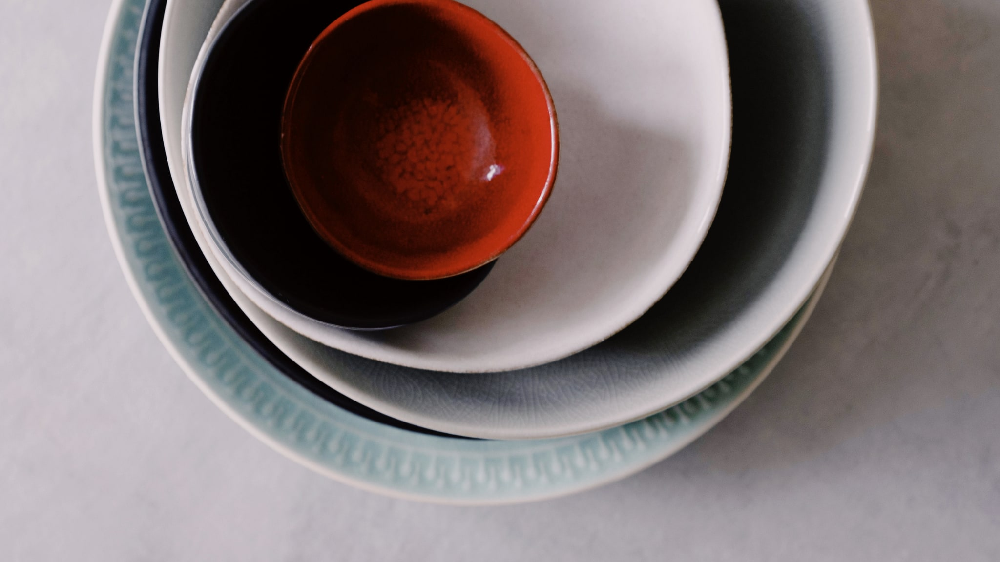

Er is geen product dat zo goed te fotograferen is en zo raar aanvoelt als het sheetmasker. Een slap, koud vel met gaten voor je ogen, dat naar beneden glijdt zodra je iets zegt. En toch ligt het in elke drogisterij en zit het in elk cadeaupakket.

De vraag die zelden gesteld wordt: wat is het eigenlijk, en wat doe je ermee?

## Het is vooral een vorm, geen ingrediënt

Een sheetmasker is een doek die is verzadigd met een vloeistof. Die doek is van katoen, van cellulose, van een vlies van bamboe- of houtvezel, of, bij de duurdere, van biocellulose, dat door bacteriën wordt gemaakt en aanvoelt als een tweede huid.

Het interessante is dat het doekje zelf niets is. Het is een drager. De vloeistof waar hij in gedrenkt is, is in grote lijnen hetzelfde soort product als een essence of een serum: water, een aantal bevochtigende stoffen, misschien een extract of twee, een conserveermiddel.

Dat betekent iets nuchters: je kunt vaak hetzelfde bereiken met het serum dat je al hebt. Wat het masker toevoegt, is niet de inhoud maar de omstandigheid. De doek houdt de vloeistof op zijn plek en laat hem niet verdampen. Het is dezelfde reden dat een natte doek op je arm langer nat blijft dan hetzelfde beetje water dat je er los op giet.

En het legt je twintig minuten stil. Dat is minder een bijzaak dan het lijkt, het is voor veel mensen het enige moment op een dag waarop ze niets doen.

## Waarom je hem er ook weer af moet halen

De belangrijkste tip over sheetmaskers is er een die op weinig verpakkingen staat: laat hem niet te lang zitten. Vijftien tot twintig minuten is de gangbare aanwijzing, en die is er niet voor niets.

Zodra de doek begint uit te drogen, keert het effect om. Een vochtige doek geeft af aan je huid; een opdrogende doek is een spons die zoekt waar hij nog vocht kan halen, en dat is dan de huid eronder. Een masker dat je een uur laat liggen omdat "langer wel beter zal zijn", werkt tegen je in.

Wat je erná doet, is trouwens ook een keuze waar mensen over twijfelen. Op de doek zit vaak nog vloeistof, en op je gezicht blijft een filmpje achter. Je kunt dat rustig laten zitten en er een crème overheen doen, precies zoals je met een serum zou doen. Spoelen hoeft niet, tenzij het plakkerige laagje je tegenstaat, en dat is puur een kwestie van hoe je het prettig vindt, niet van goed of fout.

## Wat er wél en niet op de verpakking mag staan

Hier wordt het leerzaam, want de verpakking van een masker is een goede les in Europese regels.

Een cosmetisch product mag beschrijven wat het is, hoe het voelt en welke ingrediënten erin zitten. Wat het níét mag, is een werking claimen die in medisch gebied ligt. Een masker dat belooft een aandoening aan te pakken, is geen cosmetica meer maar een geneesmiddel, en dan gelden er hele andere regels, met bijbehorende toelating.

Daarom lees je op Europese verpakkingen zoveel voorzichtige taal, en daarom staat er op een Koreaanse verpakking die rechtstreeks uit Seoul is meegenomen soms iets veel stelligers. Dat is geen fout van de importeur maar een verschil in wetgeving.

Als je één gewoonte wilt aanleren bij het lezen van zo'n doosje: kijk of de belofte gaat over hoe iets aanvoelt en oogt, of over wat er in je huid gebeurt. De eerste soort mag. De tweede zou er niet moeten staan.

## Praktische dingen die niemand je vertelt

**De koelkast is optioneel.** Een koud masker voelt lekker en maakt je gezicht tijdelijk minder rood, het is hetzelfde principe als een koud washandje. Het is comfort, geen extra werking.

**De vorm past nooit.** Iedereen heeft een ander gezicht en het masker is op één maat gesneden. Knip gerust in de randen bij je neus en kin, of druk de flappen om. Er is geen prijs voor netjes.

**Er blijft vloeistof in het zakje.** Die kun je op je hals, je armen of je handen uitstrijken. Weggooien is zonde, en bewaren voor morgen is geen goed idee: zodra er lucht en vingers bij zijn geweest, is de houdbaarheid van dat restje niet meer wat de fabrikant getest heeft.

**Elke dag hoeft niet.** Een sheetmasker is geen stap die ergens in je vaste routine moet, het is iets ertussendoor. Twee keer per week is prima, één keer per maand ook.

## Kort samengevat

Een sheetmasker is een drager met vloeistof, geen apart ingrediënt. Hij houdt die vloeistof op zijn plek en houdt jou twintig minuten stil. Haal hem eraf voordat hij droog wordt, want dan draait het om. En lees de belofte op het doosje met de vraag in je achterhoofd of hij over voelen gaat, of over iets medisch, dat laatste hoort er namelijk niet te staan.
