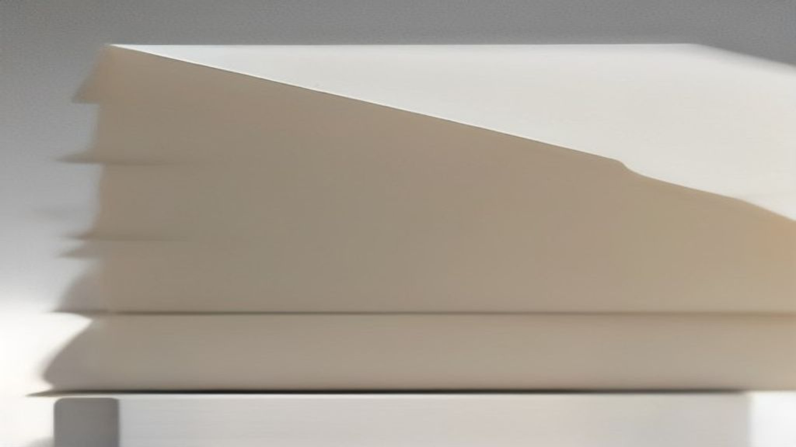
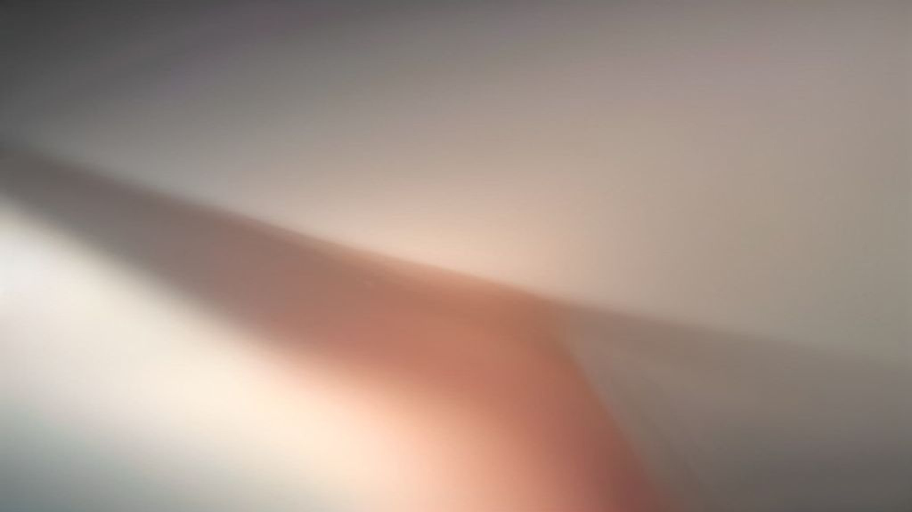

Van alle huidaandoeningen waarbij een darmverband wordt gesuggereerd, is acne degene waar het meeste onderzoek naar is gedaan. Dat maakt het een goed testgeval: als de bewijsvoering ergens sterk zou zijn, dan hier.

Het antwoord is genuanceerder dan de koppen doen vermoeden. Er is echt iets gevonden. Er is ook echt veel niet gevonden. Dit artikel loopt door beide.

## Wat acne is, kort

Acne ontstaat rond de talgklier en de haarzakjes. Er spelen minstens vier dingen tegelijk: de talgproductie neemt toe, de verhoorning in het haarzakje verandert waardoor het verstopt raakt, bacteriën die daar van nature leven krijgen andere omstandigheden, en er komt een ontstekingsreactie op gang.

Wat daarbij opvalt: hormonen sturen een groot deel van dat proces aan. Dat is de reden dat acne zo sterk met leeftijdsfases samenhangt, en het is ook de reden dat een verklaring die alleen naar de darm kijkt per definitie onvolledig is.

Dit is een aandoening. Wat je erover leest op een site als deze is uitleg van onderzoek, geen advies. Wie er last van heeft, is bij een huisarts of dermatoloog aan het goede adres — dat is geen formaliteit maar de kortste route naar iets wat werkt.

## Wat het darmonderzoek laat zien

Een review uit *Microorganisms* uit 2022 bracht het onderzoek naar acne, microbiota en probiotica bij elkaar. De auteurs beschrijven acne als een langdurige ontstekingsziekte van de huid met meerdere oorzaken, en zetten uiteen hoe er tussen darmmicrobiota en huid een tweerichtingsverkeer aan signalen wordt verondersteld, vooral via het immuunsysteem.

Een mechanisme dat ze specifiek noemen, is de invloed op IGF-1, een groeifactor die met de talgproductie samenhangt. Dat is interessant, omdat het een concrete schakel biedt tussen wat je eet, wat je stofwisseling doet, en wat er in de talgklier gebeurt — in plaats van een vaag "alles hangt samen".

De systematische review uit *Dermatology Reports* uit 2022 vond bij acne inderdaad een samenhang met dysbiose, dus met een afwijkende samenstelling van de darmflora ten opzichte van vergelijkingsgroepen. Die samenhang was voor acne relatief consistent, in tegenstelling tot bijvoorbeeld constitutioneel eczeem, waar de bevindingen elkaar tegenspraken.

Tot zover het goede nieuws.

## De beperkingen, van de onderzoekers zelf

De review uit *Dermatology Reports* baseerde de conclusie over acne op vier onderzoeken. Vier. Met verschillende opzet, verschillende populaties en verschillende meetmethodes.

De auteurs van de acne-review uit *Microorganisms* zijn even duidelijk over hun eigen onderwerp: het klinische onderzoek naar orale probiotica bij acne is beperkt. Zij noemen de richting veelbelovend en pleiten voor voortzetting van het onderzoek — wat precies de formulering is die je gebruikt als er nog geen conclusie te trekken valt.

Er is nog iets. "Veelbelovend" en "aanleiding tot verder onderzoek" zijn in de vakliteratuur normale, eerlijke bewoordingen. In marketing worden ze vertaald naar "onderzoek toont aan". Dat is geen nuanceverschil maar een betekenisomkering.

## Waarom je hier geen productadvies vindt

Op dit punt zou een artikel als dit richting een aanbeveling kunnen bewegen. Dat gebeurt hier niet, en daar zijn twee redenen voor.

De eerste is inhoudelijk: vier onderzoeken met wisselende opzet, plus een review die zelf om meer onderzoek vraagt, dragen geen advies. Wie er toch een advies op bouwt, verkoopt zekerheid die niet bestaat.

De tweede is juridisch, en die is absoluut. De Europese voedselveiligheidsautoriteit EFSA rondde in 2011 de beoordeling af van bijna drieduizend zogeheten *general function*-gezondheidsclaims. Claims rond probiotica werden afgewezen, onder meer omdat niet werd aangegeven om welk specifiek micro-organisme het ging, waardoor er geen verband te toetsen viel tussen een aanwijsbare stof en een aanwijsbaar effect.

Sindsdien geldt: er is geen enkele toegelaten Europese gezondheidsclaim over probiotica, darmflora of microbioom. Het woord "probiotisch" op een verpakking wordt zelf al als gezondheidsclaim aangemerkt. Een Nederlandse site die zou schrijven dat een product met bepaalde bacteriën iets doet voor je huid, overtreedt daarmee de regels — ongeacht wat de auteur denkt te weten.

## De samenvatting waar je iets aan hebt

- Acne is het best onderzochte voorbeeld binnen het darm-huid-onderwerp, en er is bij acne een tamelijk consistente samenhang met een afwijkende darmflora gevonden.
- Die samenhang is gemeten op één moment in de tijd. Of de darmflora bijdraagt aan de acne, of andersom, of dat beide door iets anders komen, is met dit type onderzoek niet vast te stellen.
- Er is een aannemelijk mechanisme voorgesteld via het immuunsysteem en via IGF-1, maar een aannemelijk mechanisme is geen aangetoond effect.
- Het aantal studies is klein en de opzetten lopen sterk uiteen.
- De onderzoekers zelf vragen om meer en beter onderzoek. Dat is hun conclusie, niet een slag om de arm.

Wat blijft er over? Een onderwerp dat het waard is om te volgen, en dat op dit moment nog geen enkele belofte kan dragen. Wie iets anders beweert, weet ofwel meer dan de vakliteratuur, ofwel minder.

Voor de bredere context van dit onderwerp: [de inleiding over de darm-huid-as](/gut-skin/darm-huid-as) legt uit waarom samenhang en oorzaak hier zo makkelijk door elkaar lopen.
