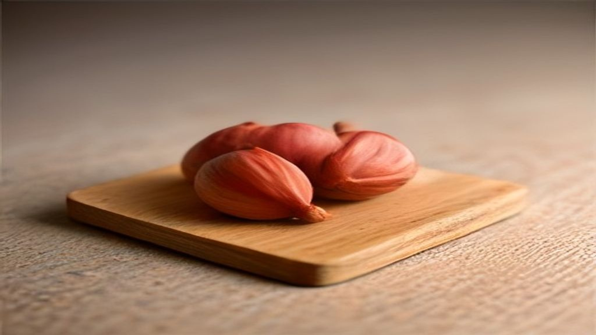
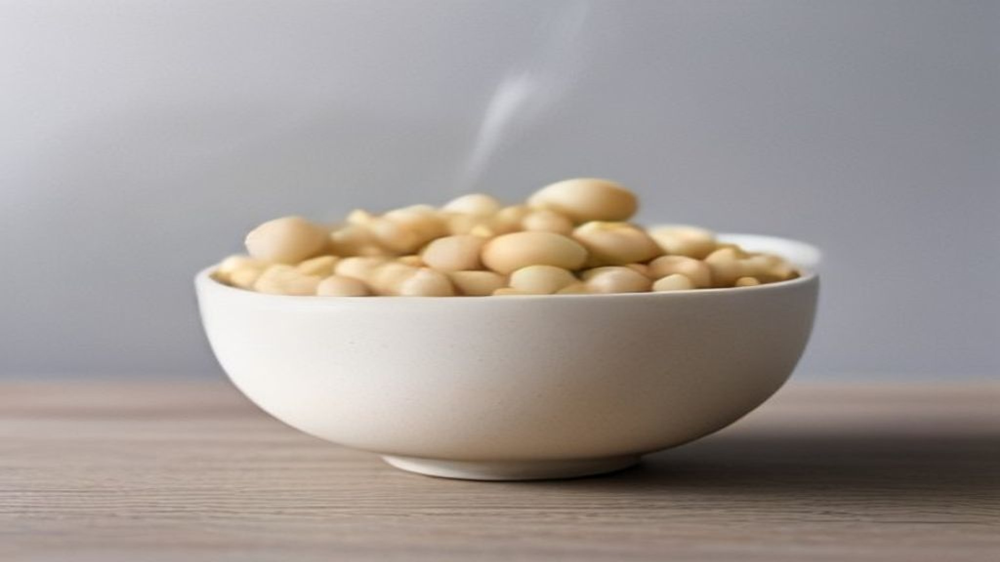

Als één voedingsstof het schap "huid, haar en nagels" draagt, is het deze. Biotine — ook bekend als vitamine B8 of vitamine H — staat op vrijwel elk potje in dat rijtje, meestal in hoeveelheden die een veelvoud zijn van wat iemand op een dag nodig heeft.

Dat is opvallend, want een tekort eraan is in Nederland zeldzaam. Dit artikel gaat over wat er precies over gezegd mag worden, waar het in zit, en waarom die hoge doseringen zo gewoon zijn geworden.

## De twee toegestane zinnen

Op de Europese lijst uit Verordening (EU) nr. 432/2012 staan voor biotine onder meer deze twee:

> Biotine draagt bij tot de instandhouding van normale huid

> Biotine draagt bij tot de instandhouding van normaal haar

Dat is meer dan de meeste voedingsstoffen krijgen — de meeste hebben er geen enkele over huid. Het verklaart waarom deze stof zo dominant is op dat schap: het is een van de weinige waarbij "huid" en "haar" in dezelfde zin met de stof genoemd mogen worden.

Let ook hier op wat er staat. Instandhouding van wat normaal is. Er staat niet: dikker haar, sterkere nagels, minder uitval. Wie dat leest op een verpakking, leest een claim die niet is toegelaten.

Merk op dat "nagels" in beide zinnen ontbreekt. Voor nagels bestaan wél toegelaten formuleringen, maar dan voor zink en seleen, niet voor biotine. Het rijtje "huid, haar en nagels" op de voorkant van een potje biotine is dus, wettelijk gezien, één woord te lang.

## Waar het in zit

Biotine zit verspreid door een breed rijtje alledaagse producten, en dat is meteen de reden dat een tekort ongebruikelijk is.

**Ei.** De dooier is de bekendste bron, en zoals hieronder blijkt is het eiwit een verhaal apart.

**Noten en zaden.** Amandelen, walnoten, pinda's, zonnebloempitten.

**Peulvruchten.** Sojabonen, linzen, kikkererwten.

**Orgaanvlees.** Lever is met afstand de rijkste bron, al staat die bij weinig mensen wekelijks op tafel.

**Volkoren graan, paddenstoelen, zuivel, banaan.** Bescheidener bronnen, maar wel de producten die dagelijks langskomen.

Daar komt iets bij dat bij de meeste vitaminen niet speelt: bacteriën in de dikke darm maken zelf biotine aan. Hoeveel daarvan het lichaam werkelijk opneemt, is niet precies bekend, maar het past bij het beeld dat dit een stof is waar je moeilijk onderuit komt.

Het gevolg is dat een tekort in Nederland vrijwel alleen voorkomt in bijzondere omstandigheden: bij een zeldzame erfelijke stofwisselingsaandoening, bij langdurig gebruik van bepaalde medicijnen tegen epilepsie, of bij het eetpatroon dat hieronder aan bod komt. Voor wie gewoon en gevarieerd eet, is het geen stof om je zorgen over te maken.

## Het rauwe eiwit

Hier zit het ene concrete, controleerbare feit dat dit onderwerp interessant maakt.

In rauw eiwit zit avidine, een stof die zich stevig bindt aan biotine en verhindert dat het wordt opgenomen. Wie langdurig grote hoeveelheden rauw eiwit eet — het klassieke voorbeeld is de bodybuilder die rauwe eieren door een shake klopt — kan daardoor daadwerkelijk in de problemen komen.

De oplossing is de simpelste die er bestaat: verhitten. Bij het koken of bakken verliest avidine zijn grip, en dan is een ei gewoon een bron van biotine in plaats van een rem erop.

Een gekookt ei is dus op dit punt een beter idee dan een rauw ei, en dat is een van de weinige plekken in dit hele onderwerp waar de bereiding echt het verschil maakt.

## Waarom de doseringen zo hoog zijn

Op de verpakkingen van haar- en nagelproducten staan hoeveelheden die vaak honderden malen de dagelijkse behoefte bedragen. Dat roept de vraag op waarom.

Het eerlijke antwoord is dat een hoog getal op een verpakking verkoopt. Biotine is goedkoop en lost makkelijk op, en omdat het wateroplosbaar is, verlaat een overmaat het lichaam grotendeels via de urine. Een hoge dosering is daarmee vooral goed zichtbaar op het etiket.

Er is één praktisch punt dat wel de moeite waard is om te kennen: hoge doseringen biotine kunnen de uitslag van bepaalde bloedbepalingen verstoren, waaronder die van de schildklier en het hart. Die uitslag wordt dan onjuist, terwijl er met de persoon niets aan de hand hoeft te zijn. Wie zulke supplementen gebruikt, doet er verstandig aan dat te melden voordat er bloed wordt geprikt.

Dat is geen reden tot zorg, wel een reden om het te noemen — het is precies het soort informatie dat op de verpakking niet in beeld komt.

## Samengevat

- Biotine heeft twee toegelaten Europese zinnen over instandhouding van normale huid en normaal haar; over nagels heeft het er geen.
- Het zit in ei, noten, zaden, peulvruchten, orgaanvlees, volkoren graan, paddenstoelen en zuivel, en darmbacteriën maken het bovendien zelf aan.
- Rauw eiwit bevat avidine, dat de opname blokkeert; verhitten haalt dat effect eruit.
- De hoge doseringen op haar- en nagelproducten zijn vooral etiketwerk, en kunnen bloedbepalingen verstoren.
