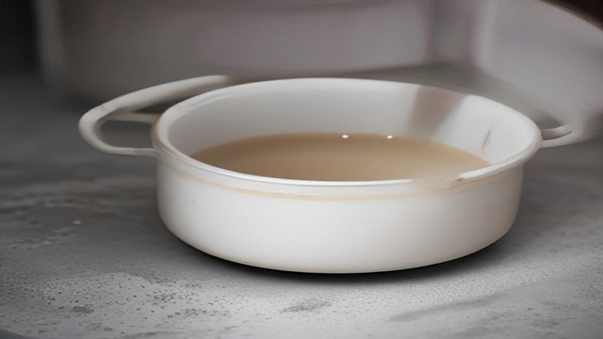
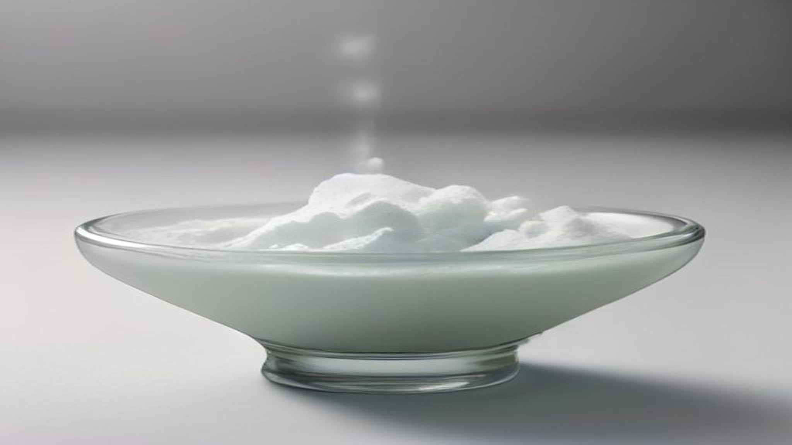

Collageen is waarschijnlijk het best verkochte poeder in het schap voor huid. Het zit in sachets, in shots, door de koffiemelk en in kleine amberkleurige potjes met een maatlepeltje erin.

Er is één ding dat je op geen van die verpakkingen zult vinden: een toegelaten Europese gezondheidsclaim over collageen en de huid. Die bestaat namelijk niet.

## Wat er op de lijst staat, en wat niet

De Europese regels werken omgekeerd aan wat de meeste mensen aannemen. Een gezondheidsclaim over voeding is niet toegestaan tenzij hij verboden is; hij is verboden tenzij hij is toegelaten. De toegelaten formuleringen staan in Verordening (EU) nr. 432/2012, en alles wat daar niet in staat, mag niet.

Zoek in die lijst naar collageen als ingrediënt en je vindt niets. Geen zin over huid, geen zin over gewrichten, geen zin over veroudering.

Er is precies één plek waar het woord voorkomt, en die gaat over een andere stof:

> Vitamine C draagt bij tot de normale collageenvorming voor de normale werking van de huid

Lees goed wat daar staat, want het is bijna het tegenovergestelde van wat een collageenpotje suggereert. Niet: collageen eten helpt de huid. Wel: vitamine C speelt een rol bij het aanmaken van collageen door het lichaam zelf. De toegelaten claim gaat dus over een sinaasappel, niet over een sachet.

Dat is een merkwaardige situatie voor een product van deze omvang: het best verkochte poeder voor de huid mag over de huid niets zeggen, terwijl een goedkope vitamine die claim wél mag voeren.

## Wat collageen eigenlijk is

Om te begrijpen waarom dit onderwerp zo lastig ligt, helpt het te weten wat het is.

Collageen is een eiwit — het meest voorkomende eiwit in het lichaam. Het zit in huid, botten, pezen en kraakbeen, en het geeft die weefsels hun stevigheid. Het lichaam maakt het zelf aan uit aminozuren, de bouwstenen waarin al het eiwit uit voeding wordt afgebroken.

Dat laatste is meteen het kernpunt. Eiwit dat je eet, komt niet als eiwit in je bloed terecht. De vertering knipt het in stukken, en die stukken worden gebruikt voor wat het lichaam op dat moment nodig heeft. Er zit geen adressticker op.

Wat als collageenpoeder wordt verkocht, is bovendien meestal niet heel collageen maar gehydrolyseerd collageen: al in kleinere stukken geknipt, zodat het oplost in een glas water. Als voedingsmiddel is dat gewoon een eiwitbron, vergelijkbaar met andere eiwitpoeders — met de kanttekening dat het als eiwit onvolledig is, want het bevat niet alle aminozuren die het lichaam niet zelf kan maken.

## Waar het van gemaakt wordt

Dit is het deel dat op verpakkingen vaak in kleine letters staat.

Collageen wordt gewonnen uit dierlijk materiaal: huiden, botten en kraakbeen van runderen en varkens, of huid en graten van vis. Er bestaat geen plantaardig collageen — planten maken die stof niet. Een product dat "plantaardig collageen" heet, bevat dus iets anders, meestal een mengsel van vitaminen en aminozuren dat bedoeld is om de eigen aanmaak te ondersteunen.

Voor wie geen varken of rund eet, of vegetarisch is, is dat een relevant detail dat in de marketing zelden vooraan staat.

De keukenversie hiervan bestaat trouwens al eeuwen. Bouillon die lang trekt op botten en kraakbeen wordt na afkoelen gelei, en dat is precies dezelfde stof die uit het weefsel is losgekomen.

## Wat er dan wél op zo'n potje mag

Als er geen claim bestaat, hoe staat het product dan in de winkel? Op drie manieren, en het is nuttig ze te herkennen.

**Via een andere stof.** Aan het poeder wordt vitamine C toegevoegd, en de toegelaten zin over vitamine C en collageenvorming komt op de verpakking. Dat is volledig legaal — de claim slaat alleen op de vitamine, niet op het collageen ernaast.

**Via woorden die geen claim zijn.** "Schoonheid van binnenuit", "voor je glow", "beauty formula". Zulke termen ontlenen hun kracht aan de suggestie en vermijden precies de formulering die getoetst zou worden. De NVWA kijkt daar wel degelijk naar, want ook een suggestieve verwijzing kan een claim zijn.

**Via een ander onderwerp.** Het product wordt neergezet als eiwitbron of als onderdeel van een routine, en de huid komt alleen in het beeldmateriaal terug.

Geen van die drie betekent dat het product niets doet. Ze laten alleen zien dat de bewering die je erin leest, niet de bewering is die het product zelf mag maken.

## Wat je hiermee kunt

Voor wie voor een schap staat: kijk of er een toegelaten zin op staat, en zo ja, waar die zin precies over gaat. Staat er een claim over vitamine C, dan koop je op dat punt vitamine C.

Verder is dit een van die onderwerpen waarbij de prijs per portie de moeite van het narekenen waard is. Als eiwitbron is collageenpoeder doorgaans een veelvoud duurder dan gewone eiwitrijke producten, en die leveren de aminozuren die het lichaam voor de eigen aanmaak gebruikt net zo goed.

## Samengevat

- Er bestaat geen toegelaten Europese gezondheidsclaim over collageen en de huid.
- De enige toegelaten zin waarin collageenvorming voorkomt, gaat over vitamine C.
- Collageen is een eiwit; verteren knipt het in aminozuren die het lichaam inzet waar het die nodig heeft.
- Het is altijd van dierlijke herkomst; "plantaardig collageen" bevat per definitie iets anders.
- De claim op de verpakking gaat vaak over een toegevoegde vitamine, niet over het hoofdingrediënt.
