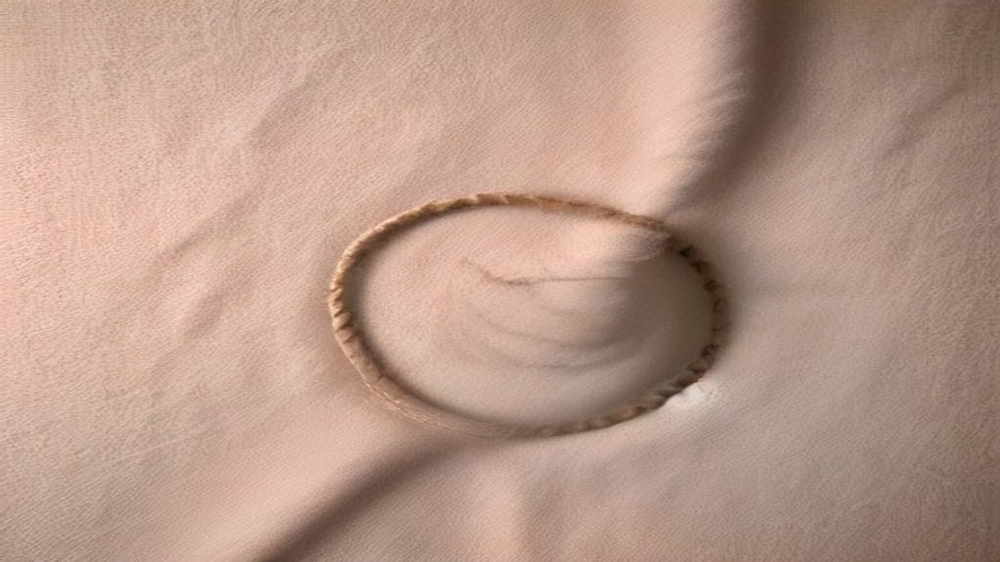
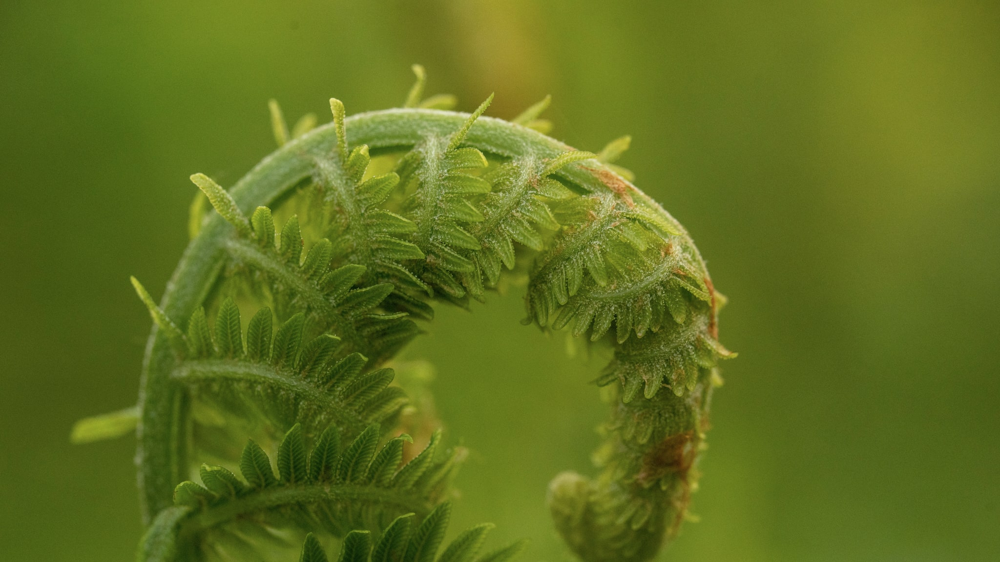

"Alles begint in de darm." Je hoort het overal, en het klinkt bevredigend: één simpele oorzaak voor iets ingewikkelds. Als je huid niet doet wat je wilt, ligt het antwoord blijkbaar ergens anders in je lichaam.

Er zit een echte wetenschappelijke kern achter dat idee. Er zit ook een flinke laag marketing overheen. Dit artikel probeert die twee uit elkaar te trekken: wat wordt er in de vakliteratuur daadwerkelijk beweerd over de darm-huid-as, hoe hard is dat, en welke stap wordt er in populaire uitleg meestal te snel gezet?

## Waar het begrip vandaan komt

De term *gut-skin axis*, darm-huid-as, beschrijft het idee dat er communicatie bestaat tussen je darmstelsel en je huid. Niet als metafoor, maar als een reeks concrete routes: via het immuunsysteem, via stoffen die in de darm ontstaan en in de bloedbaan terechtkomen, en via de zenuwverbindingen tussen darm en hersenen.

Een vaak aangehaald overzichtsartikel uit *BioEssays* uit 2016 zet die redenering netjes neer. De auteurs beschrijven darm en huid allebei als *interface-organen*: allebei vormen ze een grens tussen jou en de buitenwereld, allebei herbergen ze een eigen gemeenschap van micro-organismen, en allebei hebben ze een dichte laag immuunweefsel net onder het oppervlak. Hun kernpunt is dat een aantal darmaandoeningen opvallend vaak samengaat met huidaandoeningen, en dat stoffen die ontstaan uit voeding of uit darmbacteriën via de bloedbaan de huid kunnen bereiken.

Dat is een plausibel en interessant idee. Let goed op wat er precies staat: er bestaan verbindingen, en er zijn opvallende gelijktijdige voorkomens. Dat is iets anders dan de bewering dat je huid verandert als je je eten aanpast.

## Wat de systematische reviews laten zien

Om verder te komen dan "het is plausibel", kun je beter kijken naar overzichtsstudies die de losse onderzoeken bij elkaar vegen en wegen.

Een systematische review uit *Dermatology Reports* uit 2022 deed dat voor vier huidaandoeningen: acne, psoriasis, atopische dermatitis (constitutioneel eczeem) en netelroos. De onderzoekers vonden dat bij al deze aandoeningen afwijkingen in de samenstelling van het darmmicrobioom worden beschreven, in de vakliteratuur *dysbiose* genoemd, wat simpelweg betekent dat de verhouding tussen bacteriesoorten afwijkt van wat bij vergelijkingsgroepen wordt gezien.

Daar hoort meteen de belangrijkste kanttekening bij, en die komt van de auteurs zelf. Het aantal studies per aandoening is klein: voor acne ging het om vier onderzoeken, voor psoriasis om drie. De onderzochte groepen verschilden sterk van elkaar, net als de gebruikte methodes. En bij atopische dermatitis waren de resultaten ronduit tegenstrijdig. De auteurs schrijven letterlijk dat de rol van specifieke bacteriën als merkteken voor ontstekingsprocessen verder onderzoek vraagt.

Dat is geen verstopte voetnoot. Dat is de conclusie.

## Het gat tussen samenhang en oorzaak

Hier zit het scharnierpunt van het hele onderwerp, en het is de moeite waard om er even bij stil te staan.

Stel dat je bij mensen met een bepaalde huidaandoening consequent een andere darmflora aantreft dan bij mensen zonder die aandoening. Dan heb je een *samenhang* gevonden. Wat je daarmee nog niet weet, is welke kant het op werkt. Zorgt die afwijkende darmflora voor de huidklachten? Of zorgt de aandoening, of de aanpak ervan, of het eetpatroon dat ermee samenhangt, juist voor die afwijkende darmflora? Of wordt allebei veroorzaakt door iets derde, zoals langdurige stress, slaaptekort of een ontstekingsproces dat elders begint?

Onderzoek dat dit onderscheid kan maken, is duur en traag: je moet mensen langdurig volgen, of je moet ingrijpen bij de ene groep en niet bij de andere en vervolgens afwachten. Het meeste beschikbare onderzoek naar darm en huid is niet van dat type. Het zijn momentopnames, vaak met kleine groepen.

Wie een momentopname presenteert als een oorzaak, doet iets wat het onderzoek niet toestaat. Dat gebeurt in populaire uitleg voortdurend.

## Waarom je hier geen beloftes leest

Er is een tweede reden waarom dit onderwerp op deze site voorzichtig wordt behandeld, en die is juridisch.

In de Europese Unie mag je over voedingsmiddelen en supplementen alleen gezondheidsclaims doen die officieel zijn toegelaten. In 2011 rondde de Europese voedselveiligheidsautoriteit EFSA de beoordeling af van bijna drieduizend van dat soort claims. Claims over "probiotica" werden afgewezen, onder andere omdat de aanvragers niet aangaven om welk specifiek micro-organisme het ging, waardoor er geen verband te beoordelen viel tussen een aanwijsbare stof en een aanwijsbaar effect.

Het gevolg daarvan is streng en wordt vaak verkeerd begrepen: er bestaat op dit moment geen enkele toegestane Europese gezondheidsclaim over probiotica, darmflora of microbioom. Het woord "probiotisch" op een verpakking geldt zelf al als een gezondheidsclaim. Dat is niet de mening van deze site, dat is het geldende kader.

Voor de artikelen hier betekent dat iets concreets. Je zult hier lezen wat onderzoekers hebben gemeten en wat zij daarover schrijven. Je zult hier niet lezen dat iets goed is voor je darmen, want dat mag niemand in Nederland beweren, en het zou bovendien meer zekerheid suggereren dan er is.

## Wat je hier wél aan hebt

Als je dit onderwerp interessant vindt, is dat volkomen terecht, het ís interessant. De eerlijke samenvatting van de stand van zaken ziet er ongeveer zo uit:

- Er zijn aannemelijke, beschreven routes waarlangs darm en huid elkaar zouden kunnen beïnvloeden.
- Bij verschillende huidaandoeningen worden verschillen in darmflora gevonden ten opzichte van vergelijkingsgroepen.
- Welke kant de causaliteit op werkt, is voor vrijwel geen enkele van die aandoeningen uitgezocht.
- Het aantal studies is klein, de opzet wisselt sterk, en sommige bevindingen spreken elkaar tegen.
- Er bestaat geen goedgekeurde Europese claim over dit onderwerp, en dat is precies omdat de bewijskracht tot nu toe tekortschoot.

Dat is minder bevredigend dan "alles begint in de darm". Het heeft wel het voordeel dat het klopt met wat er in de literatuur staat.

In de andere artikelen in deze categorie ga ik dieper in op afzonderlijke stukken: wat er specifiek over acne is onderzocht, wat het verschil is tussen het microbioom van je darm en dat van je huid, en waarom voedingsadvies rond huid zo vaak verder gaat dan het onderzoek toelaat.
