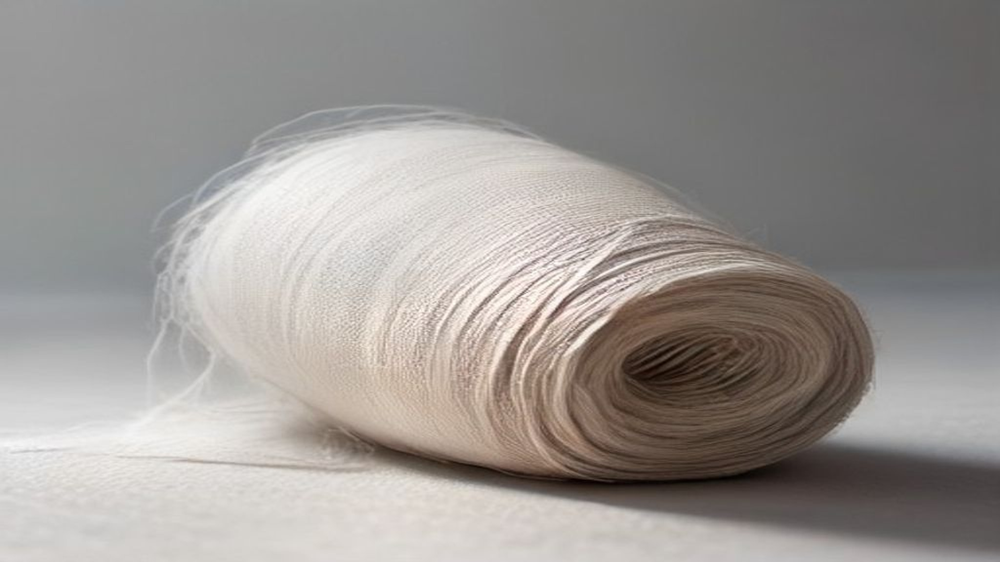
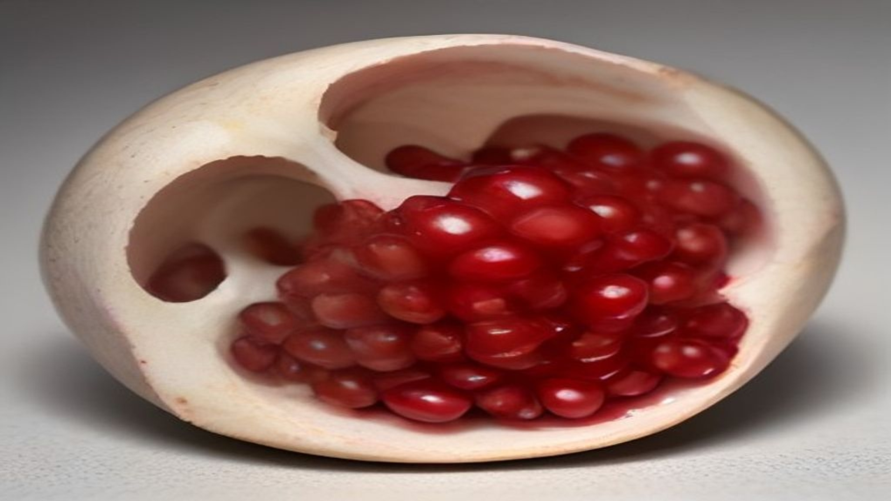

"Lekkende darm" is een van die termen die je overal tegenkomt behalve in de spreekkamer. Dat is verwarrend, want er zit wel degelijk een serieus onderzoeksonderwerp onder. Het verschil zit hem in wat er precies beweerd wordt.

Dit artikel probeert die twee lagen uit elkaar te halen: wat onderzoekers bedoelen met doorlaatbaarheid van de darmwand, en wat er in de populaire versie van dat idee is bijgekomen.

## Wat de darmbarrière is

Je darmwand moet twee dingen tegelijk doen die elkaar bijten. Voedingsstoffen moeten erdoorheen, want daar is het hele systeem voor bedoeld. Tegelijk moet vrijwel al het andere buiten blijven: bacteriën, restanten daarvan, en van alles wat je binnenkrijgt zonder het te willen.

Die selectie wordt geregeld door een laag cellen die strak tegen elkaar aan sluit. Tussen die cellen zitten eiwitverbindingen die je je kunt voorstellen als naden. Ze staan niet permanent open of dicht; ze regelen doorlaatbaarheid actief, afhankelijk van omstandigheden. Daarbovenop ligt een slijmlaag, en daaronder zit een dichte laag immuunweefsel dat continu meekijkt.

Dat immuunweefsel is de reden dat de darm überhaupt in beeld komt bij huid. Het overzichtsartikel in *BioEssays* uit 2016 beschrijft darm en huid allebei als grensorganen met veel immuunweefsel net onder het oppervlak, en beschrijft hoe stoffen die in de darm ontstaan via de bloedbaan elders terecht kunnen komen.

## Wat er wél is onderzocht

Verhoogde doorlaatbaarheid van de darmwand is een gemeten verschijnsel. Het wordt in de literatuur beschreven bij een aantal aandoeningen, waaronder darmziekten waarbij ontstekingsprocessen een rol spelen. Het is meetbaar, het is onderwerp van serieus onderzoek, en het is geen verzinsel.

De systematische review uit *Dermatology Reports* uit 2022 die vier huidaandoeningen bekeek, noemt verstoringen in het darmevenwicht en verhoogde doorlaatbaarheid als factoren die in verband worden gebracht met huidaandoeningen als acne, psoriasis en constitutioneel eczeem.

En dan komt, opnieuw, de kanttekening van de auteurs zelf: weinig studies per aandoening, sterk verschillende opzet en populaties, en bij constitutioneel eczeem tegenstrijdige uitkomsten.

## Hoe je dit überhaupt meet

Het is nuttig om te weten hoe onderzoekers doorlaatbaarheid vaststellen, want dat verklaart meteen waarom de uitkomsten zo lastig te vergelijken zijn.

De klassieke aanpak is een suikertest. Iemand drinkt een oplossing met twee suikers van verschillende molecuulgrootte. De kleine gaat er onder normale omstandigheden wel doorheen, de grote niet of nauwelijks. Door in de urine te meten hoeveel van elk is teruggevonden, krijg je een verhouding die iets zegt over de doorlaatbaarheid van de darmwand.

Daarnaast worden er stoffen in bloed gemeten die als aanwijzing gelden, zoals bepaalde eiwitten of restanten van bacteriën. Elk van die maatstaven meet net iets anders, en ze correleren onderling niet altijd goed.

Dat is precies waar het schuurt. Als drie onderzoeken drie verschillende maatstaven gebruiken bij drie verschillende groepen, is "verhoogde doorlaatbaarheid gevonden" een minder eenduidige uitspraak dan het lijkt. Een thuistest die zegt te bepalen of jouw darm "lekt", meet in de regel geen van deze dingen.

## Waar de populaire versie iets anders doet

De sprong die in de populaire uitleg wordt gemaakt, bestaat uit vier stappen die elk apart bewezen zouden moeten worden:

1. De darmwand is bij jou doorlaatbaarder dan normaal.
2. Dat komt door je eetpatroon of je leefstijl.
3. Daardoor komen stoffen in je bloedbaan die daar niet horen.
4. Daardoor ontstaan jouw huidklachten.

Elke pijl in die keten is een aanname. Bij mensen met een vastgestelde darmaandoening is stap 1 vaak aantoonbaar. Bij iemand zonder klachten die zich afvraagt of het misschien de oorzaak is van een onrustige huid, is stap 1 doorgaans niet gemeten — en de stappen daarna evenmin.

Er is nog iets. Verhoogde doorlaatbaarheid wordt bij aandoeningen aangetroffen, maar het is meestal niet duidelijk of het de oorzaak is of het gevolg. Een ontstekingsproces kan de barrière beïnvloeden. Dan zie je hetzelfde meetresultaat, met de causaliteit precies andersom.

## Waarom de term zelf in de weg zit

"Lekkende darm" klinkt als een defect dat gerepareerd moet worden, en dat frame stuurt het gesprek. Het suggereert een aan- en uitknop: je darm lekt, of niet. Zo werkt het niet — doorlaatbaarheid is een regelbare eigenschap die voortdurend verandert.

Het frame maakt bovendien een markt mogelijk. Als je iets als een defect presenteert, kun je er een oplossing bij verkopen. Dat verklaart waarom je de term vooral tegenkomt op plekken waar iets te koop is, en zelden in de vakliteratuur, waar over *intestinale permeabiliteit* wordt geschreven zonder dat er een product aan vastzit.

Hier moet ik eerlijk zijn over mijn eigen positie: ik ben geen arts en heb geen medische opleiding. Wat ik doe is lezen wat er gepubliceerd is en dat samenvatten. Voor wie klachten heeft, is dat geen vervanging van iemand die kan onderzoeken wat er werkelijk speelt.

## De stand van zaken, zonder opsmuk

- De darmbarrière is echt, belangrijk, en de doorlaatbaarheid ervan is meetbaar.
- Verhoogde doorlaatbaarheid wordt beschreven bij aandoeningen waarbij ontstekingsprocessen spelen, en wordt in reviews genoemd in verband met huidaandoeningen.
- Of het bij die huidaandoeningen oorzaak of gevolg is, is niet vastgesteld.
- De onderzoeksbasis is smal: weinig studies, wisselende methodes, tegenstrijdige uitkomsten bij een van de vier onderzochte aandoeningen.
- "Lekkende darm" als kant-en-klare verklaring voor huidklachten gaat verder dan het onderzoek draagt.

Dat is een onbevredigend antwoord op een vraag die veel mensen bezighoudt. Het alternatief is niet een beter antwoord, maar een verzonnen antwoord.

Voor de bredere context: [de inleiding over de darm-huid-as](/gut-skin/darm-huid-as). Voor de regels die bepalen wat hierover verkocht en beweerd mag worden: [het artikel over probiotica en de Europese regels](/gut-skin/probiotica-en-de-europese-regels).
