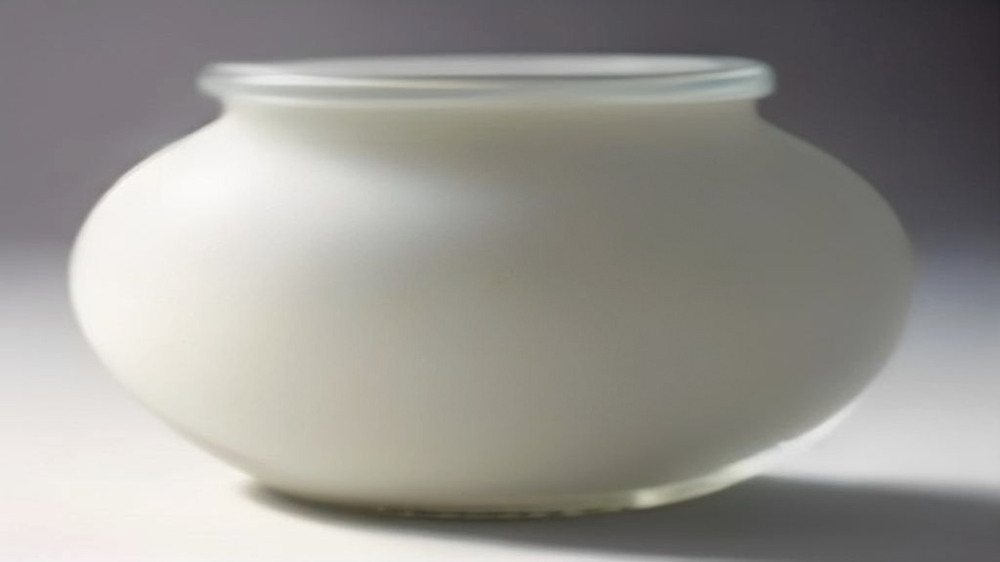
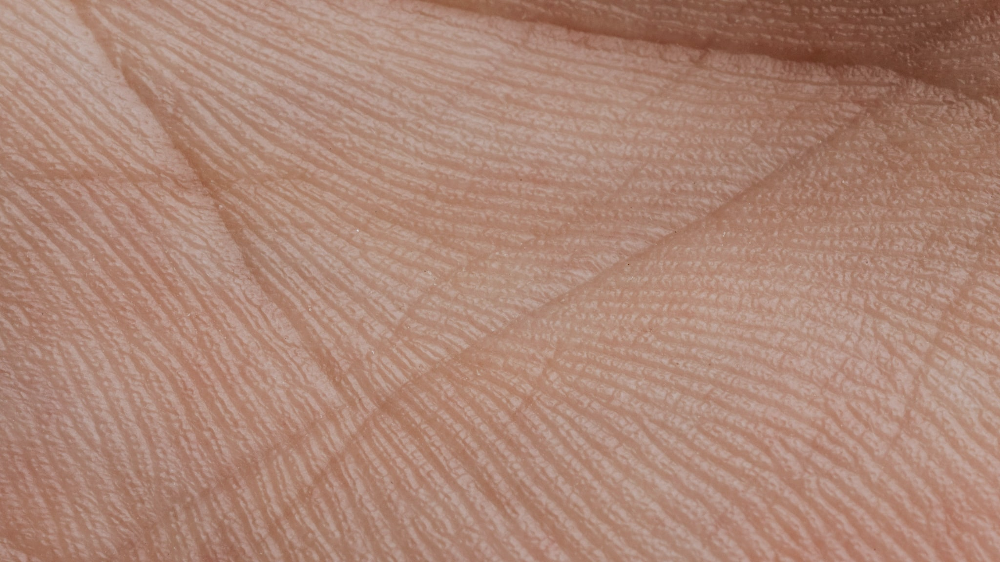

In het gesprek over huid en bacteriën lopen twee dingen voortdurend door elkaar. Aan de ene kant is er het darmmicrobioom: de gemeenschap van micro-organismen die in je darmstelsel leeft. Aan de andere kant is er het huidmicrobioom: de gemeenschap die op je huid leeft. Ze worden allebei "microbioom" genoemd, ze worden vaak in dezelfde adem besproken, en ze zijn desondanks bijna niet vergelijkbaar.

Dat verschil is niet muggenzifterij. Het bepaalt of een bewering die je leest ergens op slaat.

## Twee totaal verschillende leefomgevingen

Begin bij de omstandigheden. Je dikke darm is donker, warm, vochtig, vrijwel zonder zuurstof en er komt voortdurend voedsel langs. Het is, biologisch gezien, een uitzonderlijk gastvrije plek. De hoeveelheid micro-organismen die daar leeft, is enorm, en de verscheidenheid aan soorten ook.

Je huid is het tegenovergestelde. Die is droog, koel, zout, zuur, blootgesteld aan zuurstof en aan ultraviolet licht, en de bovenste laag schilfert continu af — je leefomgeving loopt letterlijk onder je voeten weg. Er leven daar veel minder organismen, en de soorten die het er goed doen, zijn gespecialiseerd in precies die schrale omstandigheden.

Bovendien is je huid geen enkele leefomgeving maar tientallen. De vettige zone naast je neus lijkt qua bewoners niet op je onderarm, en je oksel weer niet op je hiel. Onderzoek naar "het huidmicrobioom" gaat dus altijd over een specifieke plek, en resultaten van de ene plek zeggen weinig over de andere.

## Waarom ze toch in één zin belanden

De reden dat beide microbiomen samen besproken worden, is het idee van de darm-huid-as: de gedachte dat wat er in de darm gebeurt langs indirecte weg iets kan betekenen voor de huid.

Het overzichtsartikel in *BioEssays* uit 2016 waar dit onderwerp vaak op teruggaat, beschrijft die route zorgvuldig. Darm en huid zijn allebei grensorganen, allebei met veel immuunweefsel vlak onder het oppervlak. De voorgestelde verbinding loopt niet doordat darmbacteriën naar je gezicht verhuizen — dat gebeurt niet — maar doordat stoffen die in de darm ontstaan, bijvoorbeeld uit de vertering van voeding of uit de stofwisseling van bacteriën, in de bloedbaan terechtkomen en zo elders in het lichaam iets kunnen doen.

Dat is een indirecte, meerstapsroute. Elke stap daarin is een plek waar het onderzoek nog onvolledig is.

## Wat er gemeten wordt, en wat dat waard is

De systematische review uit *Dermatology Reports* uit 2022 die vier huidaandoeningen naast elkaar zette, keek naar het **darm**microbioom bij mensen met acne, psoriasis, constitutioneel eczeem en netelroos. Bij die aandoeningen werden verschillen in samenstelling gevonden ten opzichte van vergelijkingsgroepen.

Twee dingen zijn hier van belang.

Ten eerste zeggen die bevindingen niets over het huidmicrobioom van dezelfde mensen. Dat is een aparte vraag, met apart onderzoek, en de uitkomsten van het ene mag je niet op het andere plakken.

Ten tweede noemen de auteurs zelf hun beperkingen. Er waren weinig studies per aandoening — vier over acne, drie over psoriasis. De onderzochte groepen en de gebruikte methodes verschilden onderling sterk. En bij constitutioneel eczeem waren de resultaten tegenstrijdig: verschillende onderzoeken wezen verschillende kanten op.

Als je dat samenvat tot "onderzoek toont aan dat je darmen je huid bepalen", heb je iets anders opgeschreven dan er staat.

## Waar het in de praktijk misgaat

Het verwarren van de twee microbiomen leidt tot een paar hardnekkige misverstanden.

**Een product op je huid verandert je darmflora niet.** Een crème komt niet in je darm terecht. Wat er op je gezicht gebeurt, speelt zich af in een andere leefomgeving met andere bewoners.

**Een supplement slikken verandert je huidmicrobioom niet rechtstreeks.** Als er al iets gebeurt, verloopt dat via de omweg die hierboven staat: darm, bloedbaan, immuunsysteem, en dán pas eventueel de huid. Elke pijl in die keten is een aanname die per aandoening apart onderbouwd moet worden.

**"Microbioomvriendelijk" is geen beschermde term.** Er is geen norm die vastlegt wat een product moet doen om zich zo te mogen noemen, en er is geen toets die je als koper kunt nalopen. Het zegt dus vooral iets over de marketingafdeling.

## Wat dit betekent voor wat je leest

Als je een bewering tegenkomt over microbioom en huid, helpt het om drie vragen te stellen.

*Over welk microbioom gaat dit — darm of huid?* Als dat niet duidelijk wordt gemaakt, is dat op zichzelf al een signaal.

*Is er gemeten, of is er beredeneerd?* Er is een groot verschil tussen "bij deze groep zagen we deze samenstelling" en "dus zal dit product helpen".

*Wat zeggen de onderzoekers zelf over hun beperkingen?* In de vakliteratuur staan die beperkingen er bijna altijd gewoon bij. In de samenvatting die je op een verkooppagina leest, meestal niet.

Het eerlijke antwoord op de vraag hoe deze twee gemeenschappen zich tot elkaar verhouden, is dat we het begin van een antwoord hebben: er zijn aannemelijke routes, en er zijn gemeten verschillen bij mensen met bepaalde aandoeningen. Wat er nog niet is, is het bewijs dat je van de ene kant iets kunt veranderen om aan de andere kant een uitkomst te krijgen.

Dat is precies waarom je in dit soort artikelen geen advies aantreft, maar een stand van zaken. In [de inleiding over de darm-huid-as](/gut-skin/darm-huid-as) staat uitgebreider waarom die terughoudendheid hier geen bescheidenheid is maar noodzaak.
