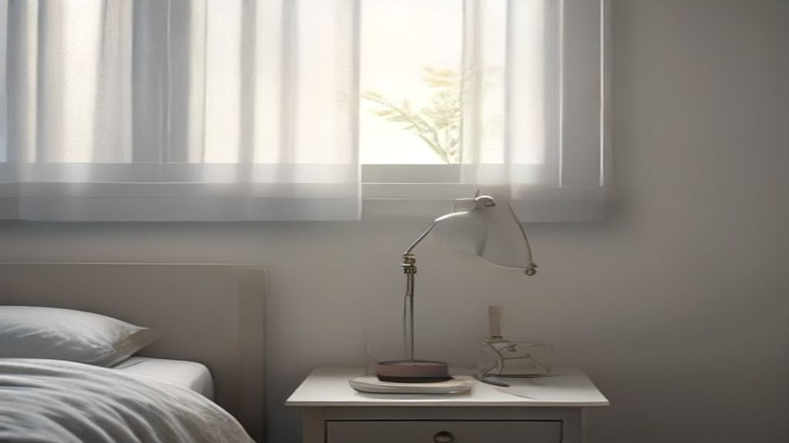
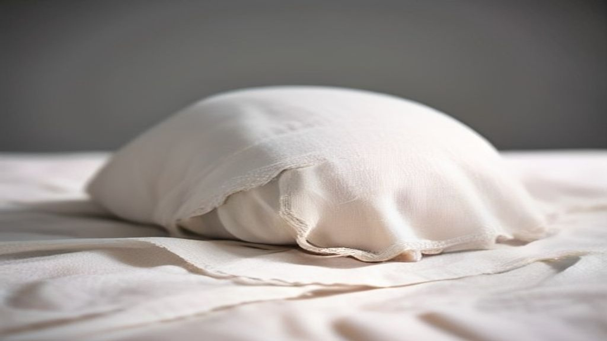

"Schoonheidsslaapje" is zo'n woord dat je niet serieus neemt tot je de metingen ziet. Slaap is namelijk een van de weinige onderwerpen in de hoek van huid en leefstijl waar niet alleen naar meningen is gevraagd, maar waar apparatuur aan te pas is gekomen.

Het is ook het enige advies in deze hele rubriek dat niets kost en niets verkoopt. Dat maakt het de moeite waard om er precies naar te kijken — inclusief hoe klein de onderzoeken zijn.

## Wat er gemeten is

Het meest aangehaalde onderzoek verscheen in 2015 in *Clinical and Experimental Dermatology*. Zestig vrouwen werden ingedeeld in twee groepen: goede slapers, met zeven tot negen uur per nacht, en slechte slapers, met vijf uur of minder en een lage score op een gangbare slaapvragenlijst.

Wat dit onderzoek onderscheidt van de meeste leefstijlverhalen, is dat er niet gevraagd is hoe de huid voelde maar gemeten hoe hij zich gedroeg. Drie dingen zijn de moeite waard.

**Vochtverlies door de huid.** Bij aanvang lag het waterverlies via de huid hoger bij de slechte slapers. Dat is een gangbare maat voor hoe goed de huidbarrière zijn werk doet: hoe meer er ongemerkt verdampt, hoe minder gesloten de barrière is.

**Herstel na beschadiging.** Hier wordt het concreet. De onderzoekers brachten met plakband een lichte, gestandaardiseerde beschadiging aan van de bovenste huidlaag, en keken hoe snel die zich sloot. Na 72 uur waren de goede slapers ongeveer 30 procent verder in dat herstel.

**Herstel na uv-licht.** Ook na blootstelling aan uv-licht liep de roodheid bij de goede slapers binnen een dag zichtbaar sneller terug.

Daarnaast scoorden de goede slapers hoger op een beoordelingsschaal voor huidveroudering, en waren ze duidelijk tevredener over hun eigen uiterlijk.

## Waarom die tape-proef het overtuigendste deel is

Van alles wat hierboven staat, is die plakbandproef het stevigst, en het is de moeite waard om te zien waarom.

Bij een beoordelingsschaal voor veroudering kijkt een mens naar een gezicht en geeft een cijfer. Bij tevredenheid over het eigen uiterlijk vraag je iemand naar een gevoel — en wie weet dat hij slecht slaapt, heeft daar een mening over. Zulke uitkomsten zijn gevoelig voor verwachting, van de beoordelaar én van de deelnemer.

De snelheid waarmee een barrière zich na een gestandaardiseerde beschadiging sluit, is dat niet. Dat is een fysiek proces met een apparaat aan het eind. Je kunt het niet beter maken door te denken dat je goed geslapen hebt.

Dat is precies het soort onderscheid dat in de doorvertelling verdwijnt. Een artikel dat dit onderzoek aanhaalt, noemt meestal de verouderingsscore, want die klinkt spannender — terwijl de barrièremeting het onderdeel is waar de conclusie het meest op rust.

## De beperkingen, zonder omhaal

Zestig deelnemers is weinig. Alle deelnemers waren vrouwen, en de groep was op één bevolkingsgroep geselecteerd. Uitkomsten uit zo'n groep gelden niet automatisch voor iedereen.

Belangrijker: de indeling was niet toegewezen maar waargenomen. Mensen zijn niet door loting slechte slaper geworden; ze waren het al. En slecht slapen komt zelden alleen. Het hangt samen met stress, met een hoger cortisolniveau, met roken, met alcohol, met minder bewegen en met onregelmatig eten. Elk van die dingen kan een deel van het gevonden verschil verklaren.

Het overzichtsartikel uit 2023 in hetzelfde tijdschrift zet die bredere context uiteen, en noemt ook de omgekeerde richting die makkelijk vergeten wordt: huidaandoeningen die jeuken of pijn doen, verstoren de slaap. Bij eczeem en psoriasis loopt het verband aantoonbaar twee kanten op. Wat oorzaak is en wat gevolg, is dan niet met een dwarsdoorsnede vast te stellen.

## Wat er aannemelijk aan is

Er is een reden waarom dit verhaal ondanks die beperkingen serieus genomen wordt: het past bij hoe het lichaam 's nachts werkt.

Herstelprocessen in weefsel lopen niet gelijkmatig over het etmaal. De celdeling in de opperhuid piekt in de nacht, en het waterverlies door de huid verloopt volgens een dagritme. Cortisol, dat overdag hoog staat en 's nachts laag hoort te zijn, remt herstelprocessen; slecht slapen houdt het langer hoog.

Dat maakt het aannemelijk dat de nacht voor de huid een ander soort tijd is dan de dag. Het maakt niet meetbaar hoeveel een uur extra slaap voor één persoon oplevert — die vraag is met dit materiaal niet te beantwoorden.

## Wat overblijft

- Er is gemeten dat slechte slapers een hoger waterverlies via de huid hebben en na een gestandaardiseerde beschadiging trager herstellen.
- Die barrièremetingen zijn het minst gevoelig voor verwachting en dragen de conclusie het sterkst.
- De groepen waren klein en niet toegewezen, dus er is samenhang vastgesteld en geen oorzaak.
- Slecht slapen hangt samen met stress, cortisol en andere leefgewoonten die zelf ook meespelen.
- Bij jeukende huidaandoeningen loopt het verband beide kanten op.

Wie meer wil over hoe je dit soort onderzoek leest: [het overzicht over voeding en huid](/gut-skin/voeding-en-huid) loopt dezelfde valkuilen langs op een ander onderwerp.
