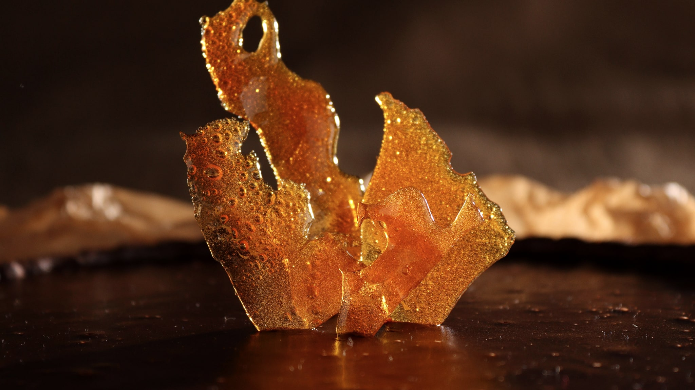
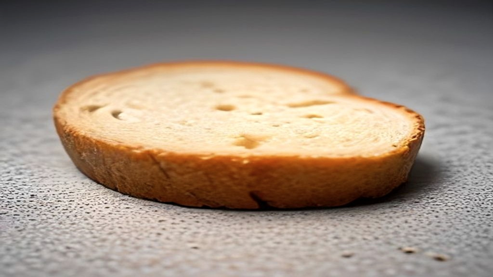

"Suiker veroudert je huid" is een van de stelligste zinnen in het hele schoonheidsvocabulaire. Er wordt meestal een wetenschappelijk klinkend woord bij geleverd — glycatie — en daarmee is de discussie doorgaans gesloten.

Het bijzondere is dat glycatie echt bestaat, echt in de huid plaatsvindt, en echt met veroudering samenhangt. De vraag is niet óf het proces bestaat. De vraag is of de stap van dat proces naar jouw suikerpot houdbaar is.

## Wat glycatie is

Glycatie is scheikunde, niet marketing. Een suikermolecuul plakt zich zonder tussenkomst van een enzym aan een eiwit vast. Uit die verbinding ontstaan na een reeks vervolgstappen stabiele eindproducten, in de literatuur *advanced glycation end products* genoemd, afgekort AGE's.

Het is dezelfde soort reactie die brood zijn korst geeft en vlees zijn bruine kleur in de pan. In het lichaam gaat het alleen traag: over jaren in plaats van minuten.

Waarom dat voor de huid uitmaakt, staat beschreven in een overzichtsartikel in *Dermato-Endocrinology* uit 2012. Collageen en elastine — de eiwitten die de huid stevigheid en veerkracht geven — gaan heel lang mee. Ze worden veel langzamer vervangen dan de meeste andere eiwitten in het lichaam. Juist die lange levensduur maakt ze een geschikt doelwit: hoe langer een eiwit blijft zitten, hoe meer tijd er is om zo'n verbinding op te lopen.

Wat er dan gebeurt, is dat die lange vezels aan elkaar gekoppeld raken. Het weefsel wordt stugger en minder elastisch. Bij mensen met diabetes, waar de bloedsuiker langdurig hoger staat, is dat proces duidelijk sneller zichtbaar — en dat is een van de sterkste aanwijzingen dat het verhaal in de kern klopt.

## Waar de redenering oprekt

Tot hier is het stevig. Nu de sprong die in productteksten bijna altijd stilzwijgend gemaakt wordt.

Van "glycatie speelt een rol bij het verouderen van huidweefsel" naar "minder suiker eten geeft je een jongere huid" zitten een paar stappen die niet zijn ingevuld.

**Eén: hoeveel van de AGE's in je huid komt door wat je eet?** Het lichaam vormt ze zelf uit de suiker die in het bloed circuleert, en die spiegel wordt door veel meer gestuurd dan door de suikerpot alleen. Daarnaast zitten er kant-en-klare AGE's in voeding — vooral in wat hard en droog verhit is, zoals gebraden vlees, korstjes en gefrituurd eten. Hoeveel daarvan de vertering overleeft en werkelijk in huidweefsel belandt, is niet goed vastgesteld.

**Twee: is het omkeerbaar?** De hele aantrekkingskracht van het idee zit in de belofte dat je er iets aan kunt doen. Maar deze eindproducten zijn juist stabiel — dat is wat "end product" betekent. Wat al gevormd is, verdwijnt niet doordat je vanaf morgen minder suiker eet.

**Drie: hoe meet je het?** Veel van wat er over AGE's en huid bekend is, komt uit laboratoriumopstellingen of uit vergelijkingen tussen mensen met en zonder diabetes. Dat is iets anders dan aantonen dat een gezond persoon die minder suiker eet, een meetbaar ander huidverouderingsverloop krijgt.

Geen van deze drie punten maakt het idee onzin. Ze laten zien dat er tussen een goed beschreven scheikundig proces en een concreet voedingsadvies nog een flink gat zit — en dat het advies dat gat routineus overslaat.

## Waar de suiker-huidlijn wél proefondervindelijk is bekeken

Er is één plek waar niet naar veroudering maar naar acne is gekeken, en waar wel met groepen is geëxperimenteerd.

In de *American Journal of Clinical Nutrition* verscheen in 2007 een gerandomiseerde studie: 43 jonge mannen met acne, twaalf weken lang, de ene helft op een eetpatroon met een lage glykemische lading en de andere op een gewoon koolhydraatrijk patroon. De beoordelaars wisten niet wie waar zat. De groep met de lage glykemische lading kwam er gunstiger uit, zowel op de acnetelling als op de insulinegevoeligheid.

Let op wat dit wel en niet zegt. Het gaat over acne, niet over rimpels. Het gaat over de snelheid waarmee koolhydraten de bloedsuiker laten stijgen, niet over glycatie. En de groep was klein en eenzijdig samengesteld: 43 mannen tussen 15 en 25 jaar.

Toch is het relevant, want het is een van de weinige plekken in dit hele onderwerp waar de opzet een richting kán aanwijzen in plaats van alleen een samenhang. Alleen loopt de route dan via insuline, niet via het proces waar de anti-agingteksten hun woord aan ontlenen.

## De stand van zaken

- Glycatie is een echt proces dat echt aan huidveroudering bijdraagt; het overzicht uit 2012 beschrijft dat degelijk.
- Collageen en elastine zijn er extra gevoelig voor doordat ze lang meegaan.
- Bij langdurig verhoogde bloedsuiker is het verloop duidelijk sneller, wat het beeld in de kern ondersteunt.
- Hoeveel gewone suikerinname bij een gezond persoon daaraan bijdraagt, is niet vastgesteld.
- De gevormde eindproducten zijn stabiel, dus "terugdraaien" is geen realistische verwachting.
- Wat er wél gerandomiseerd is bekeken, gaat over acne en verloopt via insuline.

Wie het bredere plaatje wil: [het overzicht over voeding en huid](/gut-skin/voeding-en-huid) legt uit waarom juist dit vakgebied zo moeilijk tot zekerheid komt, en [het artikel over zuivel en acne](/gut-skin/zuivel-en-acne) laat zien hoe dezelfde insulineroute daar terugkomt.
