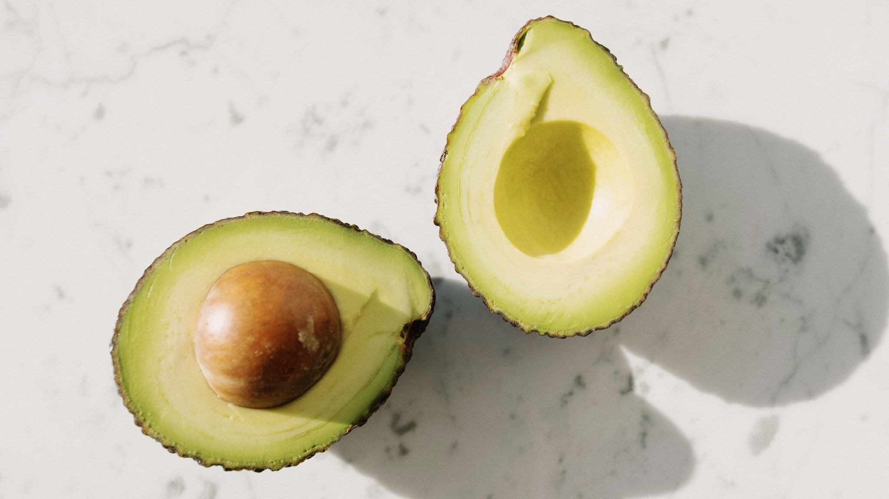
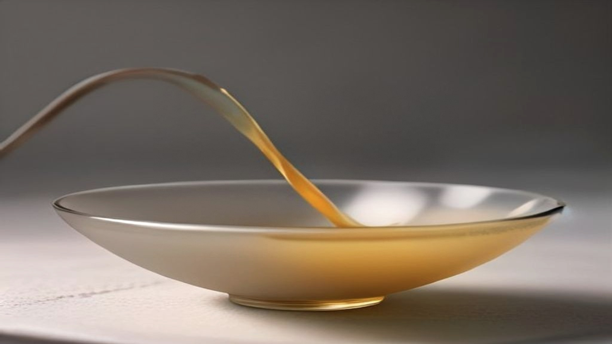

Vitamine E is een van die voedingsstoffen waar in de reclame veel omheen wordt gezegd en in de wet heel weinig. Precies één zin mag erover gebruikt worden, en die zin gaat niet over huid.

Dat maakt het een aardig geval om uit te pluizen: wat zit erin, waar zit het in, en waarom is de toegestane bewoording zo veel voorzichtiger dan de verpakking?

## De ene zin

De Europese lijst met toegelaten gezondheidsclaims staat in Verordening (EU) nr. 432/2012. Voor vitamine E staat daar dit:

> Vitamine E draagt bij tot de bescherming van cellen tegen oxidatieve stress

Meer niet. Geen huid, geen veroudering, geen herstel. Dat is opvallend, want juist die woorden staan wél op de verpakkingen waar deze stof in verwerkt zit.

Wat "bescherming van cellen tegen oxidatieve stress" betekent, is bovendien nuchterder dan het klinkt. Vetten in het lichaam kunnen reageren met zuurstof; vitamine E is vetoplosbaar en gaat die reactie tegen. Dat is een gewone huishoudelijke functie van het lichaam, niet een belofte over hoe je eruit komt te zien.

Ook hier geldt de voorwaarde die bij elke claim hoort: een product mag die zin alleen dragen als er genoeg vitamine E in zit om als bron te gelden.

## Waar het in zit, kort gezegd: in vet

Vitamine E is vetoplosbaar, en dat verklaart de hele lijst in één keer. Waar vet zit, zit vitamine E; waar geen vet zit, zit het niet.

**Plantaardige oliën.** Zonnebloemolie staat bovenaan, gevolgd door saffloer- en tarwekiemolie. Olijfolie levert minder dan zonnebloemolie, maar nog altijd een noemenswaardige hoeveelheid.

**Noten en zaden.** Amandelen, hazelnoten, zonnebloempitten. Een handvol amandelen is een van de eenvoudigste manieren om er een flinke portie van binnen te krijgen.

**Avocado.** De uitzondering op het beeld dat vitamine E uit een flesje of een zakje komt.

**Groene bladgroente.** Spinazie en boerenkool leveren een bescheiden hoeveelheid, maar ze staan vaak op tafel.

**Volkoren graan.** Weer via de kiem en de zemel, de delen die bij witmeel verdwijnen.

Wat er níét in zit, is even nuttig om te weten. Mager eten levert weinig vitamine E, hoe gezond het verder ook is. Wie vet grotendeels vermijdt, mist deze stof bijna automatisch mee.

## Waarom de bereiding hier uitmaakt

Bij de meeste voedingsstoffen is de manier van bereiden een detail. Bij deze niet, en dat is het praktische punt van dit hele artikel.

Vitamine E gaat kapot van hitte, licht en lucht. Een fles olie die maandenlang open op het aanrecht in de zon staat, is er een stuk armer aan dan dezelfde fles achter een kastdeur. Frituren en langdurig hard bakken kosten een aanzienlijk deel van wat erin zat.

Daaruit volgt iets bruikbaars: de vitamine E in olie komt het best tot zijn recht als je de olie koud gebruikt. Een scheut over een salade, door de hummus, over de soep aan tafel in plaats van in de pan. Dat is geen truc maar simpelweg de stof niet weggooien voordat hij op je bord ligt.

Voor noten geldt iets vergelijkbaars, zij het milder: rauw levert meer op dan gebrand.

## Waarom er geen huidclaim is

Hier wordt het interessant, want de afwezigheid van een zin zegt evenveel als de aanwezigheid ervan.

Voor een aantal andere voedingsstoffen bestaat wél een toegelaten formulering over de huid, zink, biotine, niacine, riboflavine, vitamine A en jodium mogen alle zes de instandhouding van een normale huid noemen. Voor vitamine E is die formulering er niet.

Dat is geen omissie. Elke claim op de lijst is los beoordeeld, en wat het niet haalde, staat er niet op. Wie op een verpakking of in een advertentie tóch vitamine E aan de huid koppelt, gebruikt dus een claim die niet is toegelaten, hoe aannemelijk het verband ook klinkt.

Het is het soort detail dat je nergens ziet zolang je niet weet waar je naar kijkt, en dat daarna nauwelijks meer te negeren is.

## Hoeveel, en de bovengrens

De aanbevolen hoeveelheden per leeftijd en levensfase houdt het Voedingscentrum bij; dat is de aangewezen plek daarvoor.

Twee dingen die wel hier thuishoren. Een tekort is in Nederland ongebruikelijk bij mensen die normaal en gevarieerd eten, deze stof zit in zoveel gewone producten dat je hem moeilijk helemaal misloopt. En omdat vitamine E vetoplosbaar is, slaat het lichaam een overmaat op in plaats van hem uit te plassen. Er geldt dan ook een bovengrens, en die is bij hoog gedoseerde supplementen sneller in beeld dan bij eten.

Ook hier dus: genoeg is genoeg, en meer is geen verbetering.

## Samengevat

- Er is precies één toegelaten Europese zin over vitamine E, en die gaat over de bescherming van cellen tegen oxidatieve stress, niet over huid.
- Het zit in plantaardige olie, noten, zaden, avocado, bladgroente en volkoren graan; overal waar vet zit.
- Hitte, licht en lucht breken het af, dus olie koud gebruiken levert meer op dan olie verhitten.
- Dat er geen huidclaim bestaat, is een beoordeling geweest en geen vergetelheid.
