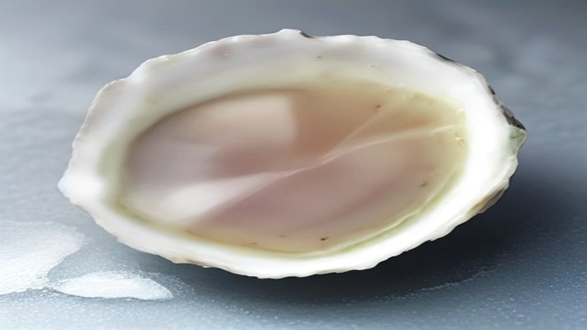
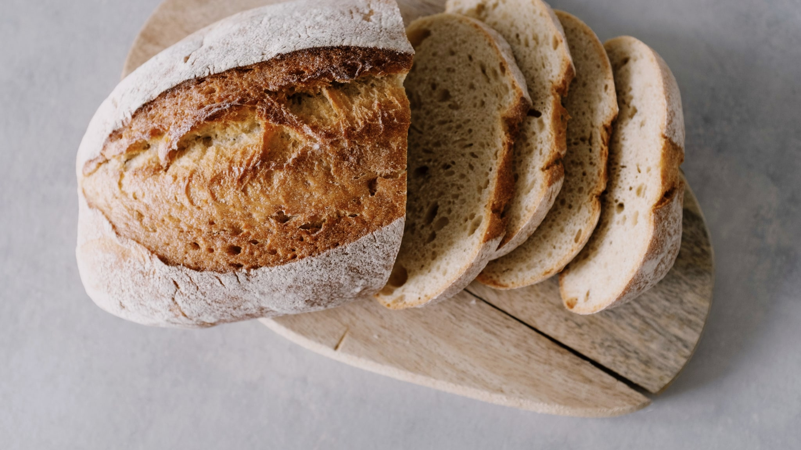

Zink is het mineraal dat op de verpakking staat van vrijwel alles wat "huid, haar en nagels" belooft. Dat is geen toeval: het is een van de weinige stoffen waarvoor de Europese wetgever daadwerkelijk toestaat dat die woorden gebruikt worden.

Wat op zo'n potje niet staat, is dat zink ook gewoon in eten zit, en dat de toegestane bewoording een stuk terughoudender is dan de verpakking suggereert.

## Wat er precies gezegd mag worden

In de EU ligt vast welke gezondheidsclaims over voeding gebruikt mogen worden. Niet ongeveer: letterlijk. De vastgestelde lijst staat in Verordening (EU) nr. 432/2012, en wie een andere formulering kiest, ook een die hetzelfde lijkt te betekenen, gebruikt een claim die niet is toegelaten.

Voor zink zijn er vier die hier van belang zijn:

> Zink draagt bij tot de instandhouding van een normale huid

> Zink draagt bij tot de instandhouding van normaal haar

> Zink draagt bij tot de instandhouding van normale nagels

> Zink draagt bij tot de bescherming van cellen tegen oxidatieve stress

Lees ze nog eens, want er staat minder dan je op het eerste gezicht leest. Er staat "instandhouding van een normale huid", het op peil houden van iets wat al normaal is. Er staat niet: mooier, gladder, rustiger, of sneller herstellend.

Dat verschil is de kern van de hele claimwetgeving. Een voedingsstof mag een normale lichaamsfunctie ondersteunen. Zodra een tekst belooft dat er iets verbetert of dat een klacht verdwijnt, valt hij buiten wat is toegestaan.

Er hoort nog een voorwaarde bij: zo'n claim mag alleen op een product staan dat genoeg zink bevat om als bron te gelden. Een snufje in een verder zinkarm product geeft het recht op die zin niet.

## Waar het in zit

Zink komt uit een breder rijtje dan de meeste mensen denken.

**Schaal- en schelpdieren.** Oesters staan met afstand bovenaan; er zit meer zink in dan in welk ander gewoon voedingsmiddel ook. Praktisch is het voor de meeste huishoudens geen dagelijkse kost, maar het verklaart wel waarom ze in elk lijstje als eerste genoemd worden.

**Vlees.** Rood vlees is een stevige bron, gevogelte een matige.

**Noten en zaden.** Pompoenpitten, cashewnoten, hennepzaad en sesam. Dit is de categorie die het makkelijkst dagelijks meedraait, bijvoorbeeld door een handvol door yoghurt of een salade.

**Peulvruchten.** Linzen, kikkererwten, bonen.

**Volkoren graan.** De zemel, de buitenste laag van de korrel, bevat het meeste. Precies die laag wordt bij wit meel weggeslepen, waardoor witbrood er beduidend minder van overhoudt dan volkorenbrood.

**Zuivel en ei.** Bescheidener, maar ze tellen mee omdat ze bij veel mensen elke dag langskomen.

## De kanttekening bij plantaardige bronnen

Hier zit een detail dat in de meeste lijstjes ontbreekt, en het is precies het soort nuance dat de moeite waard is.

In volkoren graan, peulvruchten, noten en zaden zit fytinezuur. Die stof bindt zich in de darm aan mineralen, waaronder zink, waardoor een deel ervan het lichaam weer verlaat zonder opgenomen te zijn. Hetzelfde brood dat een goede bron van zink heet, levert dus minder op dan het cijfer op papier belooft.

Dat is geen reden om volkoren te mijden, het gaat om de rest van het pakket. Wel is het de reden dat het bij plantaardig eten verstandig is om de bronnen te spreiden over de dag in plaats van erop te vertrouwen dat één portie het regelt.

Er is ook iets aan te doen, en dat is oude keukenwijsheid met een reden erachter. Peulvruchten een nacht weken en het weekwater weggooien haalt een deel van het fytinezuur eruit. Hetzelfde geldt voor zuurdesem: bij het rijzen breekt een deel van die stof af, wat zuurdesembrood op dit punt gunstiger maakt dan snel gerezen brood.

## Hoeveel, en waarom dat hier niet staat

De aanbevolen dagelijkse hoeveelheid verschilt per leeftijd, per geslacht en bij zwangerschap, en ligt bij een volledig plantaardig eetpatroon hoger vanwege dat fytinezuur. Het Voedingscentrum houdt die getallen bij en is daarvoor de aangewezen plek, niet een site als deze.

Wat wél de moeite waard is om te weten: meer is hier niet beter. Zink kent een bovengrens, en die is niet ruim. Langdurig veel meer binnenkrijgen dan nodig verstoort de opname van koper, een ander mineraal dat het lichaam nodig heeft. Bij deze stof is het rijtje "genoeg is genoeg" dus geen slap compromis maar het feitelijke advies.

## Wat een supplement wel en niet is

Een supplement is een aanvulling op voeding, en zo ziet de wet het ook: als levensmiddel, niet als geneesmiddel. Daaruit volgt alles wat hierboven staat. Een potje mag melden dat de inhoud bijdraagt aan de instandhouding van een normale huid. Het mag niet beweren dat het iets oplost.

Wie gevarieerd eet met noten, zaden, peulvruchten en volkoren graan, komt er in de praktijk doorgaans zonder potje. Wie daar om welke reden dan ook niet aan toekomt, kan een aanvulling overwegen, en doet er goed aan dat te bespreken met een huisarts of diëtist in plaats van met een verpakking.

## Samengevat

- Zink is een van de weinige voedingsstoffen met een toegelaten Europese claim over huid, haar én nagels.
- Die claim gaat over instandhouding van wat normaal is, niet over verbetering. Dat is geen slordige formulering maar een bewuste grens.
- Het zit in schaaldieren, vlees, noten, zaden, peulvruchten, volkoren graan, zuivel en ei.
- Bij plantaardige bronnen remt fytinezuur de opname; weken en zuurdesem helpen daartegen.
- Meer dan genoeg is hier geen verbetering, want het gaat ten koste van de koperopname.
