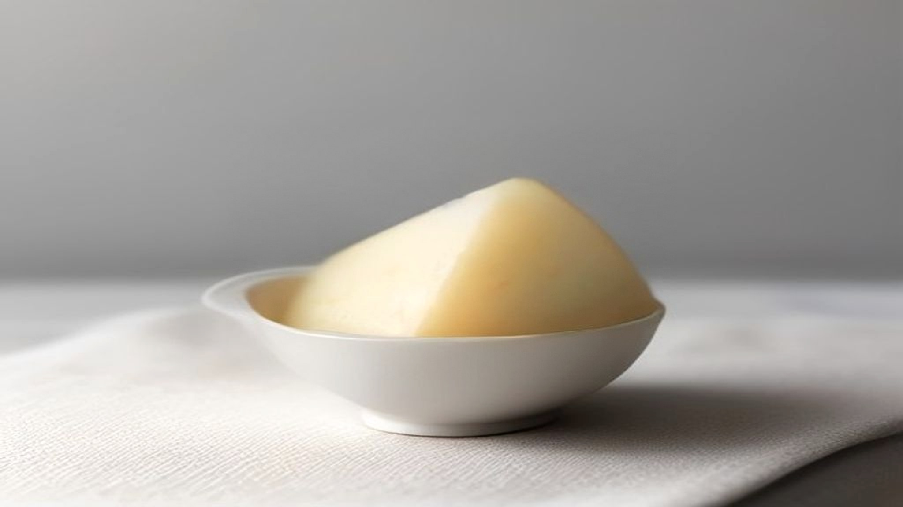
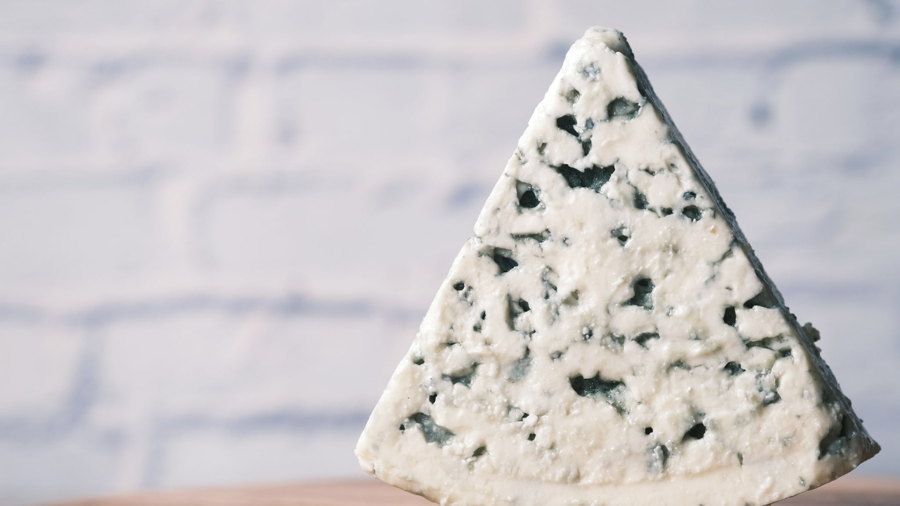

Van alle voedingsadviezen bij acne is er één die het vaakst terugkomt: laat zuivel staan. Het is ook een van de weinige waar daadwerkelijk een flinke stapel cijfers onder ligt.

Die cijfers zijn interessanter dan zowel de voorstanders als de sceptici er meestal van maken. Er wordt namelijk wel degelijk een samenhang gevonden, en tegelijk is het niet het verhaal dat je erover leest.

## Wat er is onderzocht

In 2018 verscheen in *Nutrients* een systematische review met meta-analyse die veertien studies bij elkaar bracht: 78.529 mensen tussen de 7 en 30 jaar, waarvan ruim 23.000 met acne.

Dat is een stevig aantal, en het is meteen de reden dat dit onderwerp zich onderscheidt van de meeste voeding-en-huidclaims. Bij veel andere ingrediënten bestaat er één klein onderzoek dat eindeloos wordt doorgeciteerd. Hier ligt er een berg data.

De uitkomst: er is een samenhang tussen het gebruiken van zuivel en het hebben van acne. Die samenhang gold voor melk in alle varianten, vol, halfvol en mager, en ook voor yoghurt en kaas kwam er iets uit, zij het zwakker.

Eén detail is opvallend genoeg om apart te zetten. Magere melk kwam er niet beter uit dan volle melk; in verschillende analyses zelfs iets ongunstiger. Dat is precies andersom dan je zou verwachten als vet de boosdoener was, en het is een aanwijzing dat het ergens anders in zit.

## Wat "samenhang" hier betekent

Nu het deel dat in de koppen wegvalt.

Alle veertien onderzoeken in die meta-analyse waren waarnemend van aard. Er is dus gekeken naar wat mensen aten en of ze acne hadden, niemand heeft een groep melk laten drinken en een andere groep niet, om vervolgens te kijken wat er gebeurde.

Dat verschil is niet academisch. Waarnemend onderzoek kan niet uitsluiten dat iets anders het verband verklaart. Tieners die veel melk drinken, verschillen gemiddeld ook op andere punten van tieners die dat niet doen: leeftijd, hormonale fase, wat ze verder eten, hoeveel ze sporten. En er is nog een richting die makkelijk over het hoofd wordt gezien, iemand die al acne heeft, kan zijn eetpatroon aanpassen, waardoor oorzaak en gevolg omdraaien.

De auteurs zijn hier zelf duidelijk over: ze beschrijven een verband en concluderen niet dat zuivel acne veroorzaakt.

Daar komt bij dat de gevonden effecten in omvang bescheiden zijn. Een statistisch overtuigend verband in een groep van bijna tachtigduizend mensen kan voor één individu een klein verschil betekenen. Grote aantallen maken een verband zichtbaar; ze maken het niet groot.

## De route die het aannemelijk maakt

Als er een verklaring is, wijst het meeste naar IGF-1, een groeifactor die het lichaam zelf aanmaakt.

De review in *Microorganisms* uit 2022 beschrijft die route bij acne: IGF-1 hangt samen met de talgproductie en met de verhoorning in het haarzakje, de twee processen die bij het ontstaan van acne vooraan staan. Melk verhoogt de IGF-1-spiegel, dat is ook logisch, want melk is bedoeld om een jong zoogdier te laten groeien.

Dat verklaart bovendien waarom mager niet gunstiger uitpakt dan vol: de stoffen die deze route aanjagen zitten in het eiwitdeel, niet in het vet. Wie de magere variant kiest, haalt het vet eruit en laat precies het deel zitten waar het vermoedelijk om gaat.

Let op de status van deze uitleg: het is een aannemelijk mechanisme, geen vastgesteld feit. Het laat zien dat het verband niet toevallig hoeft te zijn. Het bewijst niet dat het zo werkt.

## Wat er wél proefondervindelijk is bekeken

Er bestaat één hoek van dit onderwerp waar wel met groepen is geëxperimenteerd, en dat gaat niet over zuivel maar over koolhydraten.

In 2007 verscheen in de *American Journal of Clinical Nutrition* een gerandomiseerde studie waarin 43 jonge mannen met acne twaalf weken lang ofwel een eetpatroon met een lage glykemische lading volgden, ofwel een gewoon koolhydraatrijk patroon. De beoordelaars wisten niet wie in welke groep zat. De groep met de lage glykemische lading kwam er gunstiger uit, zowel op de acnetelling als op de insulinegevoeligheid.

Dat is een opzet die wél een richting kan aanwijzen. Meteen de beperkingen erbij: 43 deelnemers is klein, het waren uitsluitend mannen van 15 tot 25, en de twee eetpatronen verschilden op meer dan één punt tegelijk, de proefgroep at ook meer eiwit. Wat er precies het verschil maakte, is daarmee niet vast te pinnen.

Interessant is wel dat beide sporen op dezelfde plek uitkomen: insuline en IGF-1. Zuivel en snelle koolhydraten zouden dan niet twee losse verhalen zijn, maar twee ingangen naar hetzelfde proces.

## Wat je hier redelijkerwijs uit kunt halen

Geen advies, daarvoor is dit niet de plek, en bij een aandoening is een huisarts of dermatoloog de kortste route. Wel een eerlijke stand van zaken:

- De samenhang tussen zuivel en acne is met veel deelnemers herhaaldelijk gevonden en is daarmee steviger onderbouwd dan de meeste voeding-en-huidverhalen.
- Al dat materiaal is waarnemend, dus een oorzaak is er niet mee vastgesteld.
- Magere melk komt er niet beter uit dan volle, wat tegen vet als verklaring pleit en naar het eiwitdeel wijst.
- Er is een aannemelijke route via IGF-1, en die verbindt dit onderwerp met wat er over snelle koolhydraten gevonden is.
- De effecten zijn in omvang bescheiden; voor één persoon kan het uitmaken, maar het is geen schakelaar.

Wie dit onderwerp verder wil volgen: [het artikel over acne en darmonderzoek](/gut-skin/acne-en-darmonderzoek) gaat dieper in op wat er over de darm zelf bekend is, en [het overzicht over voeding en huid](/gut-skin/voeding-en-huid) legt uit waarom dit soort onderzoek zo lastig sluitend te krijgen is.
