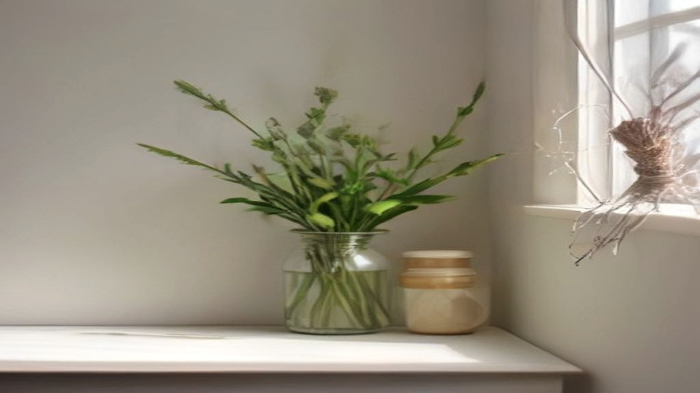
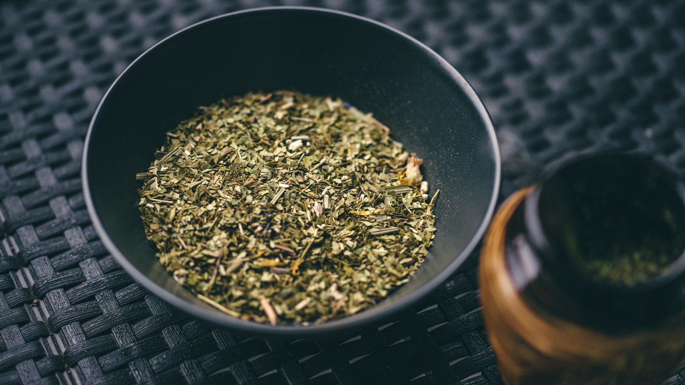

Bijvoet — in Koreaanse productteksten meestal *mugwort*, in het Koreaans *ssuk* — is in korte tijd het kalmerende ingrediënt van dienst geworden. Het zit in essences, maskers, reinigingsoliën en badproducten, meestal in donkergroene verpakkingen met veel verwijzingen naar traditie.

Die traditie is er echt: bijvoet wordt in Korea al lang gebruikt, onder meer in badvorm en in de keuken. Wat er over de huid bekend is, is een ander verhaal — en het is een goed voorbeeld van hoe een onderzoeksdossier eruitziet dat er op afstand steviger uitziet dan van dichtbij.

## Welke plant precies?

Hier begint meteen de verwarring, en die is niet triviaal.

*Artemisia* is een groot geslacht met honderden soorten. De soort die in Koreaanse verzorging het vaakst wordt gebruikt is *Artemisia princeps*, soms *Artemisia argyi*. Op het etiket staat dan *Artemisia Princeps Leaf Extract*.

Maar het onderzoek dat bij dit onderwerp wordt aangehaald, gaat vaak over andere soorten. *Artemisia annua* — zomeralsem — is een veelbestudeerde plant, onder meer omdat er een bekend antimalariamiddel uit voortkomt. *Artemisia capillaris* is weer een andere.

Dat zijn verschillende planten met verschillende stoffenprofielen. Ze delen een geslachtsnaam, en dat is ongeveer hetzelfde als aannemen dat een bramenstruik en een rozenstruik hetzelfde doen omdat ze allebei tot de rozenfamilie horen.

Wie een productbelofte leest die op onderzoek leunt, doet er dus goed aan te controleren of dat onderzoek over dezelfde soort ging. Vaak is dat niet zo.

## Wat er in het blad zit

Bijvoet bevat een mengsel dat je bij veel aromatische planten terugziet: vluchtige oliën, flavonoïden en bitterstoffen. Het is die vluchtige olie die de karakteristieke, wat kruidige geur geeft.

Twee dingen zijn daarbij het vermelden waard.

Ten eerste bevat de vluchtige olie stoffen die bij sommige mensen irritatie kunnen geven. Een plantextract dat als "kalmerend" op de markt komt, is niet automatisch mild — dat zijn twee verschillende dingen. Bij *Artemisia* speelt bovendien dat de familie waartoe de plant behoort, de composieten, bekend staat om kruisallergieën. Wie gevoelig is voor kamille, arnica of chrysant, kan ook op bijvoet reageren.

Ten tweede: bijvoetpollen is een bekende veroorzaker van hooikoorts in de nazomer. Dat gaat over inademen en niet over smeren, maar het is een reden waarom sommige mensen dit ingrediënt liever eerst op een klein plekje uitproberen.

## Het onderzoek, en wat het is

Zoek je op *Artemisia* en huid, dan vind je een behoorlijke stapel publicaties. De rode draad erin is opvallend eenduidig.

Een studie in de *Journal of Ethnopharmacology* uit 2022 keek naar een waterextract van *Artemisia annua* bij muizen waarbij met een chemische stof een huidontstekingsmodel was opgewekt. Een eerdere studie in *BMC Complementary and Alternative Medicine* uit 2014 deed iets vergelijkbaars met *Artemisia capillaris* bij muizen die voor huisstofmijt gevoelig waren gemaakt.

Beide beschrijven gunstige uitkomsten in dat model. En beide illustreren precies de drie beperkingen die dit hele onderwerp kenmerken.

**Het zijn muizen.** Muizenhuid is niet mensenhuid: hij is dunner, anders behaard en reageert anders. Een model is een vereenvoudiging die iets zichtbaar maakt, geen voorspelling van wat er bij een mens gebeurt.

**Het is een kunstmatig opgewekt beeld.** Er wordt met een chemische stof een reactie uitgelokt die op een aandoening lijkt. Dat is iets anders dan een aandoening zoals die bij mensen ontstaat en verloopt.

**Het gaat om een andere soort dan die in je potje zit.** Zie hierboven.

Dit is geen reden om het onderzoek weg te wuiven. Dierproeven met een ziektemodel zijn een normale, nuttige stap in de opbouw van kennis. Het is wel de reden dat zulke uitkomsten geen basis vormen voor een belofte op een verpakking — en dat is niet alleen een kwestie van zorgvuldigheid, maar ook van wat de wet toestaat.

## Wat een product hierover mag zeggen

Verordening (EG) nr. 1223/2009 bepaalt wat een cosmetisch product mag beweren. Reinigen, parfumeren, het uiterlijk veranderen, beschermen, in goede staat houden: dat mag. Een aandoening aanpakken of een medische werking claimen: dat mag niet.

Bij bijvoet is dat direct van belang, omdat vrijwel al het aangehaalde onderzoek over een aandoening gaat. Zulke bevindingen mogen in een artikel als dit worden samengevat. Ze mogen niet vertaald worden naar een claim op een pot.

Als je op een verpakking leest dat iets een aandoening kalmeert of verhelpt, lees je dus geen samenvatting van dat onderzoek maar een overtreding.

## Wat je op het etiket kunt nagaan

**Welke soort?** *Artemisia Princeps* is de gebruikelijke in Koreaanse verzorging. Staat er een andere soortnaam, dan is het een ander ingrediënt.

**Welk deel, en hoe verwerkt?** *Leaf Extract* is bladextract; *Leaf Water* is doorgaans veel verdunder; *Leaf Oil* is de vluchtige olie en daarmee de vorm waarin irritatie het meest waarschijnlijk is.

**Waar in de lijst?** Bijvoetextract dat na de conserveermiddelen staat, is er in kleine hoeveelheid in verwerkt.

**Composietenallergie?** Wie daar gevoelig voor is, kan dit ingrediënt beter eerst klein uitproberen.

## Samengevat

Bijvoet heeft een echte gebruiksgeschiedenis en een groeiend onderzoeksdossier dat vrijwel volledig uit proefdiermodellen bestaat, en dat bovendien vaak over een andere *Artemisia*-soort gaat dan die in Koreaanse producten zit. "Kalmerend" is een marketingwoord en geen eigenschap van de plant: dit is een aromatisch extract dat bij een deel van de mensen juist irritatie geeft.
