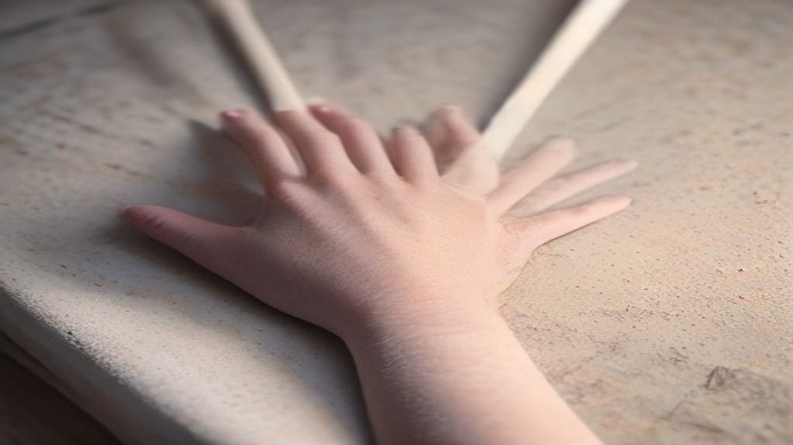
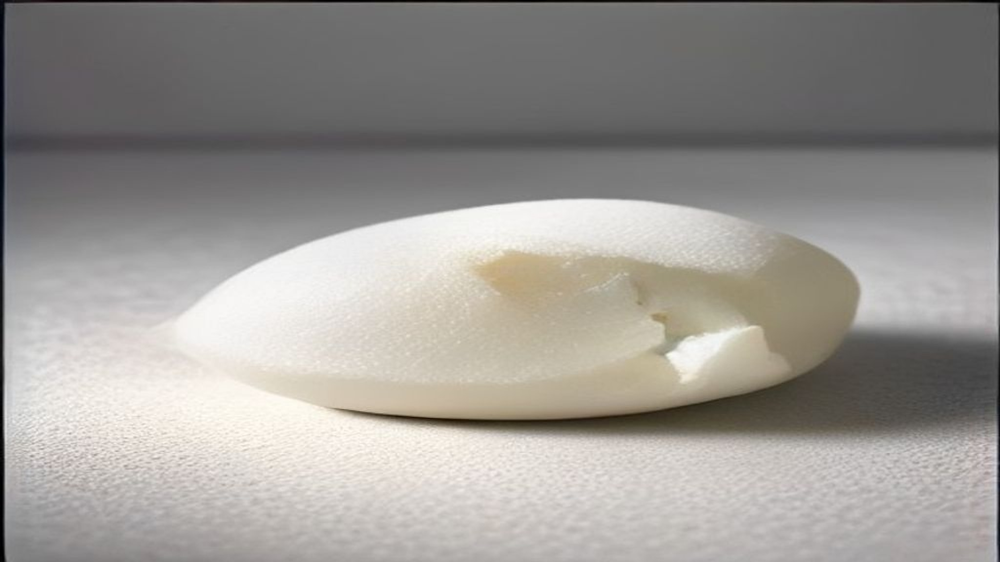

Van alle ingrediënten die de laatste jaren populair zijn geworden, is dit misschien het minst spannende en het meest fundamentele. Ceramiden zijn geen toevoeging aan je huid. Ze zijn er al, in grote hoeveelheden, en ze doen daar het werk waar je hele hoornlaag op is gebouwd.

## De baksteenmuur, en waarom die vergelijking klopt

De standaardvergelijking voor de bovenste huidlaag is een muur: de dode, afgeplatte cellen zijn de stenen, en de vetachtige stoffen ertussen zijn de specie. Die vergelijking is populair omdat hij ongewoon accuraat is.

De specie bestaat uit drie hoofdgroepen: ceramiden, cholesterol en vrije vetzuren. Ze liggen niet als een willekeurige smurrie tussen de cellen, maar in geordende lagen — lamellen — die zich netjes stapelen.

Het overzichtsartikel van Wartewig en Neubert in *Skin Pharmacology and Physiology* uit 2007 gaat precies over die ordening. De auteurs beschrijven hoe ceramiden negen subklassen omvatten en een cruciale rol spelen in de barrièrefunctie van de huid. Ze laten zien hoe verschillende ceramidetypen bij lichaamstemperatuur geordende structuren vormen met strak gepakte koolstofketens, en hoe die lipidenmatrix de belangrijkste route is die bepaalt hoe snel stoffen door de huid heen kunnen.

Dat is de kern: de ordening is het mechanisme. Niet alleen de aanwezigheid van vet, maar de manier waarop het gestapeld ligt.

## Waarom er zoveel soorten zijn

Op het etiket kom je namen tegen als Ceramide NP, Ceramide AP, Ceramide EOP of Ceramide NS. Die letters zijn geen merknamen maar een indeling.

De eerste letter zegt iets over het vetzuurdeel van het molecuul: N voor een gewoon vetzuur, A voor een variant met een extra zuurstofgroep, E voor een type met een gekoppelde, langere keten. De tweede letter slaat op het andere bouwblok: S voor sphingosine, P voor fytosphingosine, H voor een derde variant.

Ceramide NP — vroeger Ceramide 3 genoemd — is de variant die je het vaakst tegenkomt in verzorgingsproducten. Dat is geen toeval: het is een van de beter beschikbare en stabielere varianten om te produceren.

Wat je hieruit vooral kunt meenemen: "bevat ceramiden" is een minder precieze mededeling dan het lijkt, omdat de subklassen niet uitwisselbaar zijn. In de hoornlaag zijn er honderden varianten beschreven; een crème bevat er doorgaans één tot drie.

## Wat een product ermee kan, en wat niet

Hier moet ik voorzichtig formuleren, en dat is niet uit overdreven angst maar omdat de regels dit precies afbakenen.

Een cosmetisch product mag volgens Verordening (EG) nr. 1223/2009 reinigen, parfumeren, het uiterlijk veranderen, beschermen, in goede staat houden of lichaamsgeuren corrigeren. Wat het niet mag, is een medische werking claimen of zich richten op een aandoening. Bij ceramiden ligt die grens dichtbij, omdat het onderzoek ernaar vaak in een medische context plaatsvindt — bijvoorbeeld bij constitutioneel eczeem, waarbij afwijkingen in het ceramideprofiel zijn beschreven.

Wat wel te zeggen valt, feitelijk en zonder belofte: ceramiden zijn een bestanddeel van de lipidenmatrix van de hoornlaag; die matrix bepaalt mede hoe doorlaatbaar de huid is; en een verzorgingsproduct dat lipiden aanbrengt, brengt materiaal aan dat qua type overeenkomt met wat daar van nature zit.

Wat je daaruit niet mag afleiden is dat een aangebrachte ceramide zich netjes voegt in de bestaande gelaagde structuur. Dat is een andere vraag, die afhangt van de formulering, de verhouding met cholesterol en vetzuren, en van de vraag of het molecuul überhaupt op de juiste plek terechtkomt.

## De verhouding is belangrijker dan de aanwezigheid

Een terugkerend punt in het onderzoek naar hoornlaaglipiden is dat het niet om één stof gaat maar om een samenspel. Ceramiden, cholesterol en vrije vetzuren vormen samen de matrix, en de verhouding waarin ze voorkomen doet ertoe voor hoe die matrix zich ordent.

Dat verklaart waarom formuleerders die serieus met dit ingrediënt werken, zelden alleen een ceramide toevoegen. Je ziet ze vrijwel altijd in gezelschap van cholesterol en een vetzuur, en soms in een specifieke verhouding waar het merk over uitweidt.

Of die specifieke verhouding in een specifiek product daadwerkelijk uitmaakt voor jouw huid, is een vraag die je van een etiket niet kunt beantwoorden.

## Wat je op het etiket ziet

**Welke variant staat er?** Ceramide NP is gangbaar. Meerdere varianten naast elkaar wijst op een doordachtere formule, al is meer niet automatisch beter.

**Staat er cholesterol en een vetzuur bij?** Ingrediënten als cholesterol, stearinezuur of palmitinezuur naast de ceramide wijzen op een formule die het samenspel meeneemt.

**Waar in de lijst?** Ceramiden worden in lage gehaltes gebruikt en staan dus vaak onderin. Dat is hier minder veelzeggend dan bij andere ingrediënten, omdat de werkzame concentraties nu eenmaal laag liggen.

**Phytosphingosine of sphingolipiden?** Verwante stoffen die je vaak in hetzelfde gezelschap tegenkomt. Niet hetzelfde als een ceramide, wel uit dezelfde familie.

## Samengevat

Ceramiden zijn een van de weinige populaire ingrediënten waarbij de onderliggende biologie stevig en al lang beschreven is. Ze vormen samen met cholesterol en vetzuren de lipidenmatrix van de hoornlaag, en die matrix bepaalt in belangrijke mate hoe de huid zich als grens gedraagt.

Wat een specifiek product met een specifieke ceramide bij jou doet, is een aparte vraag die het etiket niet beantwoordt — en die het onderzoek naar de stof zelf ook niet beantwoordt.
