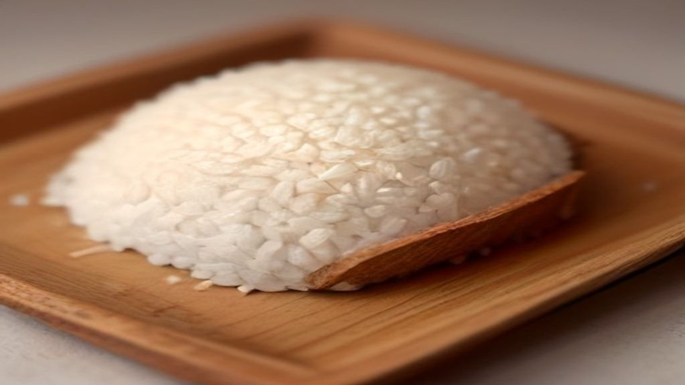
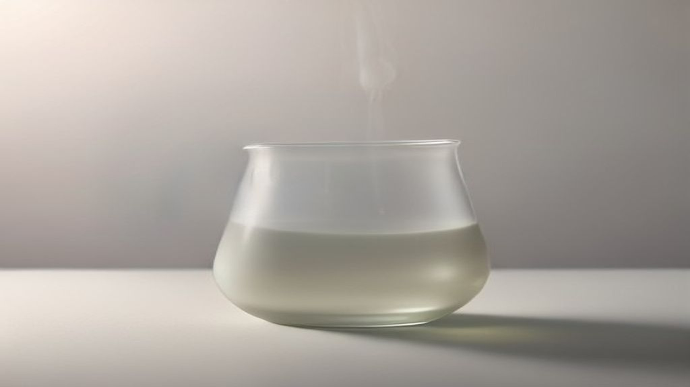

Galactomyces ferment filtrate is het ingrediënt achter een van de bekendste — en duurste — essences op de Aziatische markt. Het is ook een van de weinige cosmetische ingrediënten waarvan je kunt zeggen dat er echt langdurig klinisch onderzoek naar is gedaan.

En het is precies daar dat dit artikel over gaat. Want dat onderzoek is er wel, maar het komt bijna volledig uit één hoek.

## Wat het is

Galactomyces is een gistachtige schimmel. Het ingrediënt dat je op etiketten ziet, is niet het organisme zelf maar het *filtraat*: de vloeistof die overblijft nadat een voedingsbodem is vergist en de vaste delen eruit zijn gefilterd.

Wat er in dat filtraat zit, is dus geen enkele stof maar een mengsel van wat de gist heeft achtergelaten: aminozuren, organische zuren, vitaminen uit de B-groep, suikers en peptiden. De precieze samenstelling hangt af van de voedingsbodem, de gebruikte stam en de duur van de fermentatie.

Het oorsprongsverhaal is inmiddels folklore: iemand merkte op dat oudere sakebrouwers opvallend gladde handen hadden, ondanks een leven van zwaar werk. Als anekdote is het aantrekkelijk. Als bewijs is het niets — brouwers verschillen op tientallen manieren van willekeurige anderen, en niemand heeft indertijd iets gemeten.

## Het onderzoek dat er is

In 2023 verscheen in het *Journal of Clinical Medicine* een opvallende studie. Deelnemers gebruikten twaalf maanden lang dagelijks producten met Galactomyces ferment filtrate, en de onderzoekers rapporteerden metingen over rimpels, pigmentvlekken en ruwheid, geplaatst tegen een achtergrond van elf jaar aan huidmetingen.

Twaalf maanden is lang voor cosmetisch onderzoek. Het overgrote deel van de studies in deze sector duurt vier tot twaalf weken. Op dat punt onderscheidt dit werk zich echt.

## En nu het probleem

Kijk je naar wie het onderzoek deed, dan verandert het beeld.

Vijf van de zes auteurs zijn werknemers van Procter & Gamble, bij het Kobe Innovation Center. De zesde is als consultant aan datzelfde bedrijf verbonden. En de producten die in de studie werden gebruikt, zijn producten van een merk van P&G.

De auteurs vermelden dit netjes zelf — die openheid is precies zoals het hoort, en de studie is er niet minder eerlijk om gepubliceerd. Er staat bovendien bij dat er geen externe financiering was, wat klopt: het onderzoek werd intern gedaan.

Maar "geen externe financiering" betekent hier niet onafhankelijk. Het betekent dat het bedrijf dat het product verkoopt, het onderzoek naar dat product zelf heeft uitgevoerd, met eigen medewerkers, en de uitkomst heeft gepubliceerd.

Dat maakt de resultaten niet automatisch onjuist. Wel is het een bekend en goed gedocumenteerd verschijnsel dat onderzoek gefinancierd of uitgevoerd door een belanghebbende partij vaker gunstig uitpakt voor die partij. Dat kan door keuzes in de opzet, door welke uitkomstmaten worden gerapporteerd, en door welke studies wél en niet worden gepubliceerd.

## Waarom ik dit expliciet noem

Op deze site worden geen producten getest. Wat hier gebeurt, is lezen wat er gepubliceerd is en dat samenvatten. Juist dan is de vraag wie het onderzoek betaald of uitgevoerd heeft geen bijzaak maar een van de weinige kwaliteitssignalen die je van buitenaf kunt beoordelen.

Bij veel ingrediënten is dat lastig na te gaan. Bij dit ingrediënt staat het gewoon in de publicatie, en dan hoort het ook in een artikel als dit te staan — niet als beschuldiging, maar als context waarmee je de uitkomst kunt wegen.

Wat je hiermee kunt: als je ergens leest dat Galactomyces "klinisch onderzocht" is, klopt dat. De vervolgvraag is wie het onderzocht heeft. Die vraag hoort standaard te zijn, en is het zelden.

## Wat een product hierover mag beweren

Verordening (EG) nr. 1223/2009 beperkt cosmetische claims tot verzorging, reiniging, bescherming, het in goede staat houden en het veranderen van het uiterlijk. Zichtbare kenmerken zoals ruwheid of egaliteit vallen binnen dat kader; een medische werking claimen valt erbuiten.

Dat verklaart de voorzichtige formuleringen die je op verpakkingen van dit type product ziet. Waar het onderzoek termen gebruikt die uit de biologie komen, gebruikt de verpakking woorden over uiterlijk. Dat is niet toevallig maar noodzakelijk.

## Wat je kunt nagaan

**Staat het vooraan in de lijst?** Bij sommige producten is het ferment het eerste ingrediënt, in plaats van water. Dat is een wezenlijk andere formule dan een spoortje achterin.

**Welk ferment precies?** *Galactomyces Ferment Filtrate* is niet hetzelfde als *Saccharomyces Ferment Filtrate* of *Bifida Ferment Lysate*. Ze worden vaak op één hoop gegooid als "fermenten", maar het zijn verschillende organismen op verschillende voedingsbodems.

**Wat zit eromheen?** Fermentproducten zitten vaak in formules met niacinamide of andere actieve stoffen. Wat je aan het ferment toeschrijft, kan van de rest komen.

**Hoe reageert je huid?** Fermentfiltraten zijn complexe mengsels. Dat is voor sommige mensen prima en voor anderen een reden tot irritatie; een klein testje op een beperkt stukje huid is bij dit type ingrediënt geen overbodige voorzichtigheid.

## Samengevat

Galactomyces ferment filtrate is beter onderzocht dan de meeste cosmetische ingrediënten, en dat onderzoek loopt over ongewoon lange termijn. Het is tegelijk onderzoek van de partij die het product verkoopt. Beide feiten horen bij elkaar genoemd te worden, want los van elkaar geven ze allebei een vertekend beeld.
