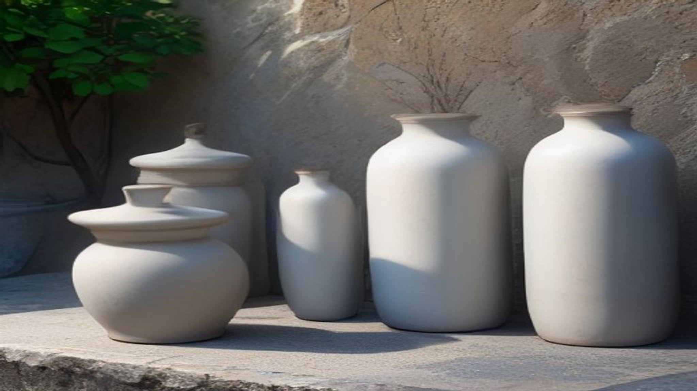
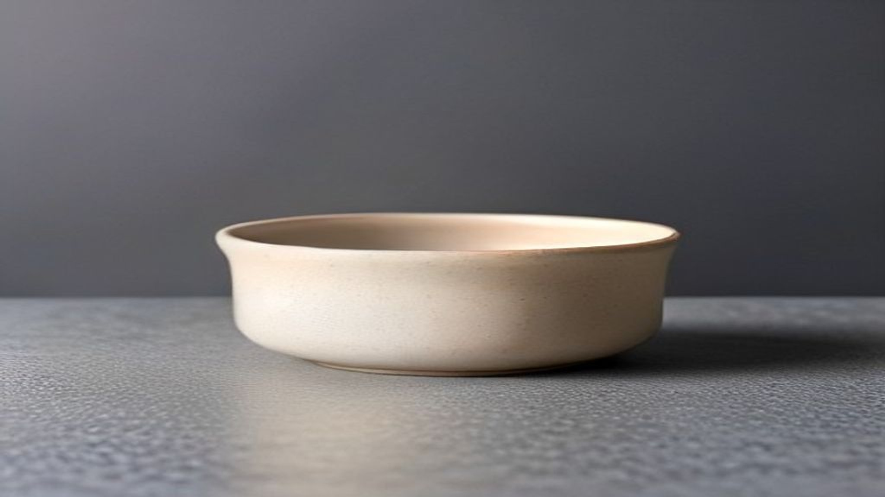

Van alle Koreaanse verzorgingsingrediënten is dit het ingrediënt dat het dichtst bij de keuken staat. Gefermenteerde soja is geen laboratoriumvondst maar een basisproduct: *doenjang* en *ganjang*, de sojabonenpasta en de sojasaus die in aardewerken potten op Koreaanse daken en terrassen staan te rijpen.

Dat het van daaruit in een serum belandde, past in een bredere Koreaanse traditie waarin gefermenteerde grondstoffen — rijst, gist, bonen — als verzorgend gelden. De vraag is wat fermentatie scheikundig eigenlijk verandert, en wat daarvan onderzocht is.

## Wat er in de boon zit

Sojabonen bevatten eiwit, olie en een groep plantstoffen die isoflavonen heten. Die laatste zijn hier het onderwerp. De bekendste heten genisteïne en daidzeïne.

Isoflavonen worden vaak fyto-oestrogenen genoemd, omdat hun molecuulvorm enigszins lijkt op die van het menselijke hormoon oestrogeen en ze aan dezelfde aanknopingspunten in het lichaam kunnen binden. "Enigszins" is hier het sleutelwoord: de binding is veel zwakker, en het effect is niet hetzelfde als dat van het hormoon zelf.

Die gelijkenis is precies waarom het ingrediënt in verzorging voor de rijpere huid opduikt. Ze is ook de reden dat je bij dit onderwerp extra kritisch moet lezen, want de sprong van "lijkt qua vorm op" naar "doet hetzelfde als" wordt in marketingteksten routineus gemaakt.

## Wat fermentatie verandert

In de boon zitten isoflavonen grotendeels vast aan een suikergroep. In die vorm zijn het grotere, minder goed opneembare moleculen.

Fermenteren betekent dat je micro-organismen op de grondstof loslaat — bij doenjang schimmels en bacteriën, bij cosmetische grondstoffen vaak een specifieke gist of bacterie. Die produceren enzymen die de suikergroep eraf knippen. Wat overblijft is de kleinere, vrije vorm van de isoflavon.

Dat is een echt, aanwijsbaar verschil, en het is de kern van het argument voor gefermenteerde soja boven gewone soja. Kleinere moleculen zouden makkelijker door de hoornlaag komen.

Dat argument is aannemelijk maar niet automatisch waar. Molecuulgrootte is één factor naast oplosbaarheid, lading en de formulering waarin de stof zit. En het gaat nog steeds om een hoornlaag die er juist is om dingen buiten te houden.

Daarnaast verandert er bij fermentatie meer dan alleen die ene suikergroep. Er ontstaan aminozuren, peptiden, organische zuren en andere afbraakproducten. Een gefermenteerd extract is dus geen "soja-extract met betere opname" maar een ander mengsel, waarvan lang niet alles in kaart is gebracht.

## Het onderzoek

Zoek je naar gefermenteerde soja en huid, dan kom je een bescheiden aantal publicaties tegen, en het patroon erin is inmiddels herkenbaar.

Een studie in *Pharmaceutics* uit 2021 bracht een gefermenteerd soja-extract op de huid aan bij ratten waarbij de eierstokken waren verwijderd — een gangbaar diermodel om een situatie met sterk verlaagde oestrogeenspiegels na te bootsen. Er werden verbeteringen gemeten in biofysische huidparameters, en er werd geen systemische giftigheid gevonden.

Een eerdere studie in *BioMed Research International* uit 2013 keek naar gedroogde gefermenteerde soja-extracten bij haarloze muizen, in een model waarin met een chemische stof oxidatieve stress in de huid werd opgewekt.

Twee dingen vallen op. Het zijn allebei diermodellen, en het tweede is bovendien een kunstmatig opgewekt beeld. En de eerste studie gebruikte niosomen — kleine blaasjes die speciaal zijn gemaakt om een stof door de huid te helpen. Dat is een aanwijzing dat de opname zonder zo'n hulpmiddel juist het knelpunt is, en het betekent dat de uitkomst niet zomaar geldt voor een gewoon serum waarin het extract los is opgelost.

## Wat een product hierover mag zeggen

Verordening (EG) nr. 1223/2009 bepaalt wat een cosmetisch product mag beweren. Reinigen, parfumeren, het uiterlijk veranderen, beschermen, in goede staat houden: dat mag. Een aandoening aanpakken of een medische werking claimen: dat mag niet.

Bij dit ingrediënt is er nog een reden tot voorzichtigheid. Een product dat suggereert dat het via hormoonachtige stoffen ingrijpt in het lichaam, beweegt zich richting een claim die voor cosmetica niet is toegestaan. Producenten schrijven daarom meestal over "rijpere huid" en "stevigheid" in plaats van over hormonen — en dat is niet vaagheid maar wettelijke noodzaak.

## Wat je op het etiket kunt nagaan

**Welke vorm?** *Glycine Soja Seed Extract* is gewoon zaadextract. *Bifida Ferment Lysate*, *Lactobacillus/Soybean Ferment Extract* en soortgelijke namen wijzen op een gefermenteerde variant, met het gebruikte micro-organisme in de naam.

**Olie of extract?** *Glycine Soja Oil* is sojaolie: een gewone plantaardige olie met een eigen vettig karakter, en iets heel anders dan een waterig isoflavonenextract.

**Waar in de lijst?** Zoals altijd — een ferment dat na de conserveermiddelen staat, is er in kleine hoeveelheid in verwerkt.

**Soja-allergie.** Sojaproteïne in verzorging is voor wie daar gevoelig voor is een reden om op te letten, ook al is de kans op een reactie via de huid kleiner dan via voeding.

## Samengevat

Gefermenteerde soja is een ingrediënt met een echte culinaire herkomst en een aanwijsbaar scheikundig verschil ten opzichte van de ongefermenteerde boon: de isoflavonen komen vrij van hun suikergroep. Of dat verschil zich vertaalt naar iets merkbaars op een gezicht, is met het huidige materiaal — diermodellen, en in één geval met een hulpmiddel om de opname te forceren — niet te zeggen. De vergelijking met oestrogeen is bovendien een gelijkenis in vorm, geen gelijkheid in werking.
