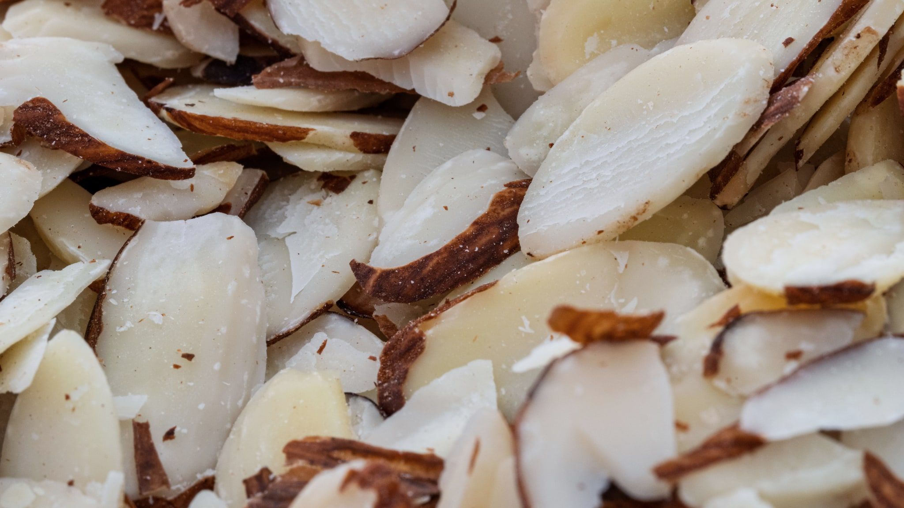
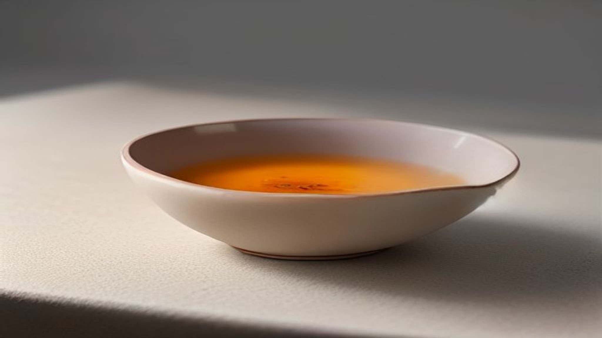

Als een Koreaanse crème in een zware pot zit, goudkleurig is verpakt en drie keer zoveel kost als de rest van de lijn, staat er een grote kans dat er ginseng in zit. Geen enkel ingrediënt draagt in die markt zoveel status.

Dat is deels cultuur en deels geschiedenis: ginseng is in Korea al eeuwenlang een kostbaar goed, met een eigen classificatiesysteem en een eigen prijskaartje. Maar wat zit er nu werkelijk in die wortel, en wat is erover bekend?

## De plant en de namen

*Panax ginseng* is een langzaam groeiende plant waarvan de wortel wordt gebruikt. Die traagheid is precies waar de prijs vandaan komt: een wortel wordt doorgaans pas na vier tot zes jaar geoogst, en de gehaltes aan werkzame stoffen lopen in die jaren op.

Op etiketten kom je een paar varianten tegen, en het verschil is niet kosmetisch.

**Verse ginseng** is de ongehavende wortel. **Witte ginseng** is geschild en gedroogd. **Rode ginseng** — in Korea *hongsam* — is gestoomd en daarna gedroogd, waarbij de wortel roodbruin wordt.

Dat stomen doet iets scheikundigs. Onder invloed van hitte breken de oorspronkelijke stoffen gedeeltelijk af tot andere, kleinere verbindingen. Rode ginseng heeft daardoor een merkbaar ander stoffenprofiel dan witte ginseng van dezelfde plant. Wie de twee als inwisselbaar beschouwt, slaat dat verschil over.

Let ook op de soort. *Panax ginseng* is Koreaanse of Aziatische ginseng; *Panax quinquefolius* is Amerikaanse ginseng, een andere plant met een ander profiel. En *Eleutherococcus senticosus*, vaak "Siberische ginseng" genoemd, is helemaal geen ginseng.

## Ginsenosiden

De stoffen waar het om draait, heten ginsenosiden. Het zijn saponinen — zeepachtige verbindingen die in veel planten voorkomen — en er zijn er van deze soort meer dan honderd beschreven.

Dat aantal is meteen het lastige. "Ginseng" op een etiket zegt niet welke ginsenosiden erin zitten, in welke verhouding, of hoeveel. Twee producten met hetzelfde INCI-woord kunnen scheikundig behoorlijk uit elkaar liggen, afhankelijk van de soort, de leeftijd van de wortel, de bewerking en de manier van extraheren.

Het overzichtsartikel in *Archives of Dermatological Research* uit 2015 gaat specifiek over wat ginsenosiden in de huid doen, en het brengt een detail naar voren dat je in productteksten nooit tegenkomt: bij een aantal van deze stoffen zijn niet de oorspronkelijke verbindingen het actiefst, maar de afbraakproducten ervan. Bacteriën in de darm zetten ginsenosiden om in kleinere vormen, en juist die vormen zijn in onderzoek vaak werkzamer.

Dat is voor een crème een ongemakkelijke constatering. De route die in dat onderzoek beschreven wordt, loopt via de spijsvertering — en die route bestaat niet als je het op je gezicht smeert.

## Wat er over de huid gepubliceerd is

Een overzicht in de *Journal of Cosmetic Dermatology* uit 2022 bracht de omvang van dit onderzoeksveld in kaart: hoeveel er verschenen is, waar, en waarover. Het beeld dat daaruit komt is dat van een veld dat groeit, met een zwaartepunt in Zuid-Korea en China.

Wat je erin terugziet, is dat het meeste werk is gedaan op gekweekte huidcellen en op proefdieren. Onderzoek waarin mensen langere tijd een ginsengbevattend product gebruiken en waarin de beoordelaar niet weet wie wat kreeg, is er veel minder.

Dat is geen reden om het ingrediënt af te schrijven. Het is wel de reden dat de stelligheid in de marketing niet in verhouding staat tot de stelligheid in de bronnen.

## Wat een product hierover mag zeggen

Verordening (EG) nr. 1223/2009 begrenst wat een verzorgingsproduct mag beweren. Reinigen, parfumeren, het uiterlijk veranderen, beschermen, in goede staat houden: dat mag. Een aandoening aanpakken of een medische werking claimen: dat mag niet.

Bij ginseng is dat extra relevant omdat de plant een lange geschiedenis in de kruidengeneeskunde heeft. Die geschiedenis mag beschreven worden. Ze mag niet als bewijs of als belofte worden ingezet op een verpakking.

## Wat je op het etiket kunt nagaan

**Welk deel?** *Panax Ginseng Root Extract* is wortelextract. *Panax Ginseng Berry Extract* komt van de bes en heeft een ander profiel. *Panax Ginseng Callus Culture Extract* komt uit een celkweek in plaats van uit een geoogste wortel.

**Rood of wit?** Staat er *Red Ginseng* of *hongsam* bij, dan is de wortel gestoomd. Dat is een andere grondstof, geen marketingtoevoeging.

**Waar in de lijst?** Bij een duur ingrediënt is dit de meest zeggende controle die er is. Ginseng dat na de conserveermiddelen staat, is er in zeer kleine hoeveelheid in verwerkt — genoeg voor de verpakking, niet genoeg om er veel van te verwachten.

**Extract of water?** *Panax Ginseng Root Water* is doorgaans veel verdunder dan een extract.

## Samengevat

Ginseng is een goed gedocumenteerde plant met een breed beschreven groep werkzame stoffen, en tegelijk een van de ingrediënten waarbij het woord op het etiket het minst zegt over wat erin zit: soort, leeftijd, bewerking en extractiemethode maken elk verschil. Het onderzoek naar de huid komt overwegend uit celkweek en proefdieren, en een deel van de beschreven werking loopt via een route die bij smeren niet bestaat. Wat je koopt bij een ginsengcrème is dus vooral: de belofte van een dure wortel.
