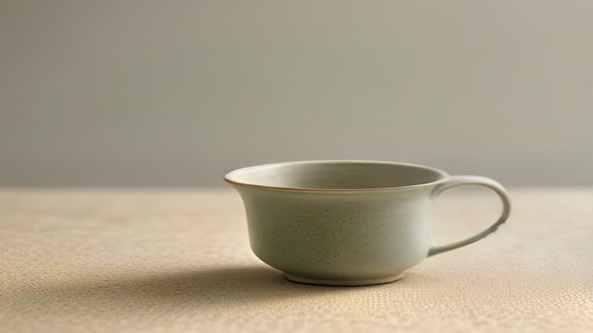
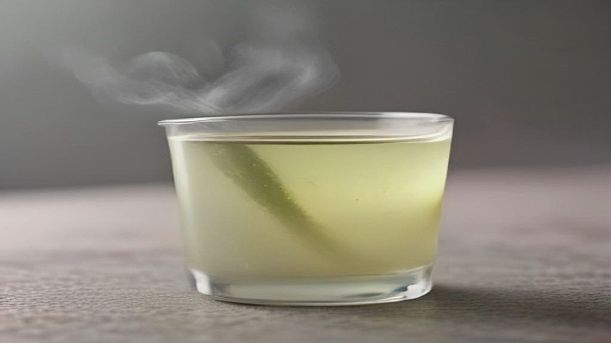

Groene thee is een van die ingrediënten die je in vrijwel elke productcategorie tegenkomt: in reinigers, in toners, in maskers, in oogcrèmes. Het staat op het etiket als *Camellia Sinensis Leaf Extract*, en het is een van de weinige plantextracten waarvan de werkzame stoffen behoorlijk goed in kaart zijn gebracht.

Dat maakt het een interessant geval, want juist bij een ingrediënt dat goed onderzocht is, wordt zichtbaar hoe groot de afstand is tussen wat er in een laboratorium gemeten wordt en wat er in een potje zit.

## Wat er in het blad zit

Groene en zwarte thee komen van dezelfde plant. Het verschil zit in de bewerking: bij zwarte thee laat je de blaadjes oxideren, bij groene thee stop je dat proces meteen door te stomen of te verhitten.

Dat is geen detail, want juist die stoffen die bij oxidatie verdwijnen, zijn de stoffen waar het hier om gaat. Groene thee bevat een groep polyfenolen die catechinen heten. De bekendste is epigallocatechinegallaat, in vrijwel elke tekst afgekort tot EGCG, en dat is met afstand de meest voorkomende catechine in het blad.

Daarnaast zitten er cafeïne in, en looistoffen, en een aminozuur dat theanine heet. In een cosmetisch extract hangt het sterk van de bereiding af wat daarvan overblijft, een extract op water gemaakt is iets anders dan een extract op alcohol, en beide zijn iets anders dan het blad zelf.

## Wat er onderzocht is

Het overzichtsartikel dat het vaakst wordt aangehaald, verscheen in 2005 in de *Journal of the American Academy of Dermatology*, onder de simpele titel "Green tea and the skin". Het brengt samen wat er tot dan toe over het onderwerp gepubliceerd was.

De rode draad: EGCG doet in laboratoriumopstellingen aantoonbaar het een en ander. Het vangt vrije radicalen weg, en er is bij proefdieren gekeken naar wat er gebeurt na blootstelling aan uv-licht.

Nu de kanttekening, en die is bij dit ingrediënt groter dan bij de meeste.

Veel van dit werk is gedaan op gekweekte cellen of op muizen, vaak met concentraties die ver boven liggen wat een gewoon verzorgingsproduct bevat. Een stof die in een schaaltje op een celkweek wordt gedruppeld, hoeft niet hetzelfde te doen wanneer hij in een crème zit die op een intacte hoornlaag wordt gesmeerd.

Dat is geen kritiek op het onderzoek, zo werkt de opbouw van kennis nu eenmaal, maar het is wel de reden dat "onderzocht" hier iets anders betekent dan "aangetoond bij mensen die het smeren".

## Het probleem waar niemand het over heeft: EGCG is instabiel

Hier zit het punt dat dit ingrediënt praktisch interessant maakt, en dat je in productteksten zelden terugvindt.

EGCG is gevoelig voor zuurstof, licht, warmte en een hogere zuurgraad. In een waterige formule breekt het na verloop van tijd af, en dat is zichtbaar: een extract dat lichtgroen of kleurloos begon, wordt geelbruin. Diezelfde reactie die zwarte thee zijn kleur geeft, verloopt gewoon door in een potje.

Daaruit volgen een paar dingen die je zelf kunt nagaan.

**De verpakking zegt iets.** Een doorzichtig potje dat je elke ochtend openschroeft, is voor deze stof de ongunstigste combinatie die er is. Een ondoorzichtige tube of een pompflacon houdt licht en lucht beter buiten.

**De kleur zegt iets.** Een groenetheeproduct dat in de loop van de maanden duidelijk donkerder wordt, vertelt je wat er met de catechinen gebeurd is.

**De plaats in de lijst zegt minder dan gewoonlijk.** Bij dit ingrediënt is de vraag niet alleen hoeveel erin ging, maar hoeveel er nog is.

Formuleerders weten dit en werken eromheen: een lagere zuurgraad, aanvullende antioxidanten, of stabielere afgeleiden van de stof. Dat verklaart waarom groenetheeproducten vaak vitamine C of vitamine E in de lijst hebben staan.

## Wat een product hierover mag zeggen

Verordening (EG) nr. 1223/2009 bepaalt wat een cosmetisch product mag beweren. Reinigen, parfumeren, het uiterlijk veranderen, beschermen, in goede staat houden: dat mag. Een aandoening aanpakken of een medische werking claimen: dat mag niet.

Bij groene thee is dat bijzonder relevant, omdat een deel van het onderzoek in de medische hoek ligt. Zulke bevindingen mogen wel beschreven worden in een artikel als dit, als samenvatting van wat er gepubliceerd is, maar ze mogen niet als belofte op een verpakking staan.

Het onderscheid zit in de rol. Uitleggen wat er in een laboratorium gemeten is, is iets anders dan beloven wat een crème gaat doen.

## Wat je op het etiket kunt nagaan

**Blad of zaad?** *Camellia Sinensis Leaf Extract* is bladextract. *Camellia Oleifera Seed Oil* is een olie van een verwante soort en een heel ander ingrediënt.

**Extract of water?** *Camellia Sinensis Leaf Water* is doorgaans veel verdunder dan een extract, en staat soms vooraan in de lijst puur omdat het de waterbasis vervangt.

**Wat zit eromheen?** Cafeïne uit thee wordt vaak apart genoemd. Staat er ook cafeïne als los ingrediënt, dan komt een deel van wat je aan het product toeschrijft mogelijk daarvandaan.

## Samengevat

Groene thee is een van de beter onderzochte plantextracten in huidverzorging, met EGCG als best beschreven bestanddeel. Het meeste van dat onderzoek komt uit celkweek en proefdieren, vaak bij concentraties die een gewoon product niet haalt. Daar komt bij dat de stof waar het om draait slecht tegen licht, lucht en warmte kan, waardoor de vraag niet alleen is wat erin zat, maar wat er nog van over is tegen de tijd dat je het opdoet.
