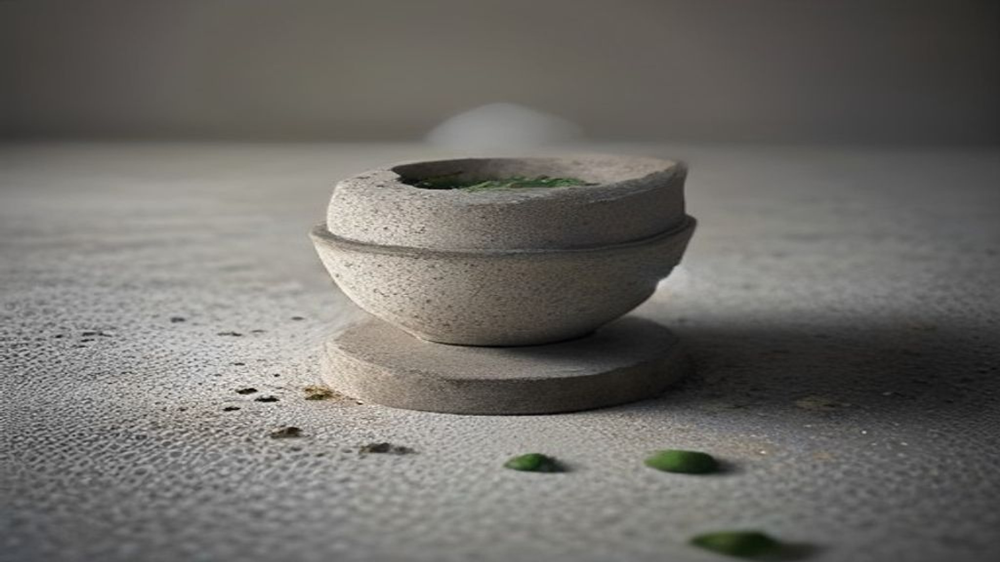

Er is een plant die in Koreaanse toners en essences steeds vaker vooraan in de ingrediëntenlijst staat, en die in het Nederlands een naam heeft die niemand gebruikt: moerasanemoon. In productteksten heet hij *Houttuynia cordata*, of gewoon *heartleaf* — naar de hartvormige blaadjes.

In het Engels heeft de plant ook een minder charmante bijnaam: *fish mint*. Daar is een reden voor, en die reden is meteen het eerste dat je moet weten als je overweegt er iets van te kopen.

## De geur

Verse houttuynia ruikt naar vis. Niet vaag, niet metaforisch — het is een uitgesproken geur die veroorzaakt wordt door een aldehyde in de vluchtige olie van de plant, en die is precies verwant aan de stoffen die je bij vis ruikt.

In Zuidoost-Azië wordt het blad rauw gegeten, en de geur hoort daar bij het product. In cosmetica is dat een probleem dat opgelost moet worden, en dat gebeurt op twee manieren: door een extractiemethode te kiezen waarbij de vluchtige olie grotendeels achterblijft, of door het te overstemmen met parfum.

Dat is nuttige informatie voor wie een product zoekt vanwege een gevoelige huid. Een houttuyniaproduct dat sterk geparfumeerd is, heeft mogelijk juist het ingrediënt toegevoegd dat de meeste mensen met een reactieve huid liever vermijden.

## Wat er in het blad zit

De stoffen die in het onderzoek naar voren komen, zijn flavonoïden — plantstoffen die ook in veel ander bladgroen zitten. Twee namen kom je steeds tegen: quercitrine en hyperoside. Daarnaast bevat de plant polysachariden en de al genoemde vluchtige olie.

Wat er in een extract belandt, hangt sterk af van het oplosmiddel. Een waterig extract haalt vooral de wateroplosbare flavonoïden en suikers eruit; een extract op alcohol trekt een andere verzameling los. *Houttuynia Cordata Extract* op een etiket zegt dus minder dan het lijkt.

## Het onderzoek: keratinocyten in een schaaltje

Hier is dit ingrediënt een schoolvoorbeeld, want het onderzoeksdossier is opvallend eenvormig.

Een studie in *Antioxidants* uit 2022 keek naar quercitrine en hyperoside uit houttuynia-extract bij menselijke keratinocyten — de meest voorkomende cel in de opperhuid — die in een kweek waren blootgesteld aan uvb-licht. Een studie in *Applied Biochemistry and Biotechnology* uit 2023 deed iets vergelijkbaars met een gefermenteerd extract, bij uva-licht en bij waterstofperoxide.

Beide beschrijven gunstige uitkomsten. En beide zijn celkweekonderzoek: cellen in een schaaltje, geen mensen met een gezicht.

Dat onderscheid is bij dit ingrediënt belangrijker dan gemiddeld, want de opzet slaat precies de vraag over die er voor een consument toe doet. Een stof die op losse keratinocyten wordt gedruppeld, heeft direct contact met die cellen. Diezelfde stof in een toner moet eerst door de hoornlaag — een laag dode, met vet aan elkaar gekitte cellen die er speciaal voor is om te voorkomen dat er dingen naar binnen komen.

Of de flavonoïden uit houttuynia die laag in noemenswaardige hoeveelheid passeren, en of ze dan in de levende opperhuid nog iets doen, is met dit type onderzoek niet te beantwoorden. Het is niet dat het antwoord negatief is — het is dat de vraag niet gesteld is.

## Waarom het toch aannemelijk is dat het iets doet

Er is een reden waarom dit soort ingrediënten in de praktijk vaak bevalt, en die heeft weinig met de flavonoïden te maken.

Een toner of essence met veel plantextract is in de kern een waterige vloeistof met suikers en zouten erin. Zulke formules voelen verzachtend aan en laten een dun, vochtvasthoudend laagje achter. Dat effect is echt, direct merkbaar, en grotendeels toe te schrijven aan de basis van het product in plaats van aan de plant.

Dat maakt het lastig om je eigen ervaring als bewijs te gebruiken: een product dat prettig aanvoelt, bewijst niet dat het aangeprezen ingrediënt het werk deed.

## Wat een product hierover mag zeggen

Verordening (EG) nr. 1223/2009 bepaalt wat een cosmetisch product mag beweren. Reinigen, parfumeren, het uiterlijk veranderen, beschermen, in goede staat houden: dat mag. Een aandoening aanpakken of een medische werking claimen: dat mag niet.

Bij houttuynia is dat relevant omdat de plant in de kruidengeneeskunde een lange staat van dienst heeft en veel van het gepubliceerde werk in de medische hoek ligt. Die bevindingen mogen in een artikel als dit worden samengevat; op een verpakking mogen ze niet als belofte staan.

## Wat je op het etiket kunt nagaan

**Extract of water?** *Houttuynia Cordata Extract* is geconcentreerder dan *Houttuynia Cordata Water*, dat vaak simpelweg de waterbasis van de formule vervangt en bovenaan de lijst staat zonder dat er veel plant in zit.

**Gefermenteerd?** Sommige Koreaanse producten gebruiken een gefermenteerde variant. Dat is een ander stoffenmengsel dan het gewone extract.

**Parfum in de lijst?** Zie hierboven — bij een product voor gevoelige huid is dat een tegenstrijdigheid die het overwegen waard is.

**Wat zit eromheen?** Houttuynia wordt vaak gecombineerd met centella of met panthenol. Wat je aan het product toeschrijft, kan net zo goed daarvandaan komen.

## Samengevat

Houttuynia cordata is een plant met een echte gebruiksgeschiedenis, een herkenbaar stoffenprofiel en een onderzoeksdossier dat vrijwel volledig uit celkweek bestaat. Wat er in een schaaltje met keratinocyten gebeurt, is een eerste stap en geen uitspraak over wat een toner op je gezicht doet. Het prettige gevoel dat zulke producten geven is echt, maar komt grotendeels van de formule eromheen — en de vissige geur van de verse plant verklaart waarom er zo vaak parfum in zit.
