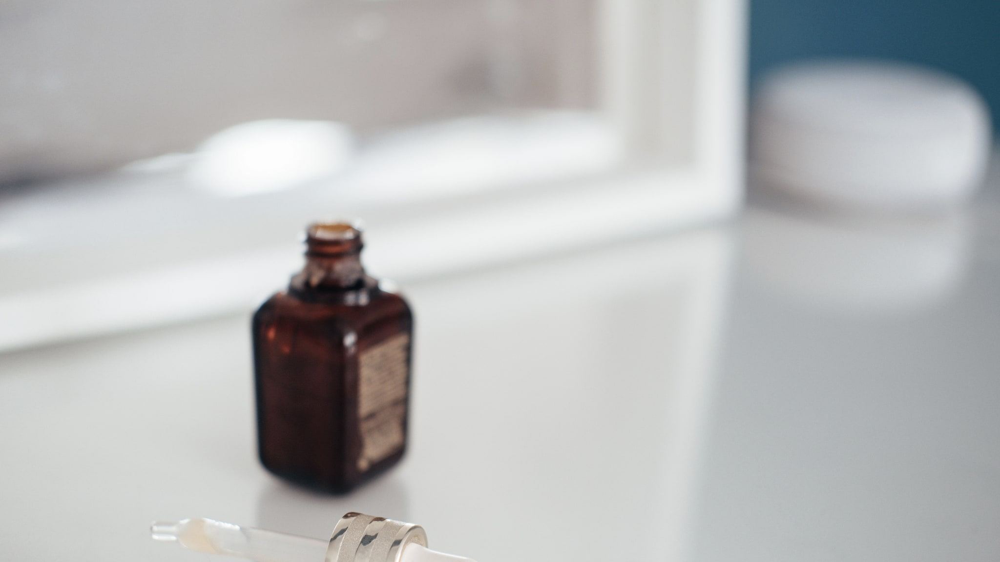
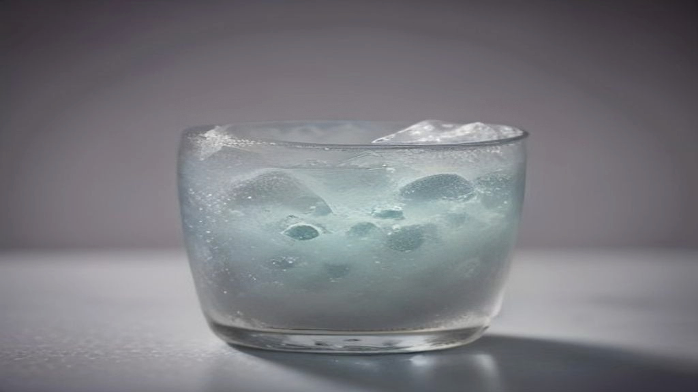

Hyaluronzuur is het ingrediënt waar het vaakst iets halfjuist over wordt gezegd. Dat het duizend keer zijn eigen gewicht aan water bindt. Dat je huid ervan uitdroogt als je in een droog klimaat woont. Dat je meerdere molecuulgroottes nodig hebt. Er zit in elk van die beweringen een kern van waarheid, verpakt in een conclusie die net niet klopt.

## Wat het is

Hyaluronzuur is een lange suikerketen die van nature in het menselijk lichaam voorkomt, onder meer in de huid, in gewrichtsvloeistof en in het oog. Het houdt water vast, en dat is vrijwel zijn hele functie.

Op ingrediëntenlijsten zie je het zelden als "hyaluronic acid". Meestal staat er *Sodium Hyaluronate*: het natriumzout van hyaluronzuur, dat stabieler is en beter oplost. Verder kom je varianten tegen als *Hydrolyzed Hyaluronic Acid* (in stukken geknipt, dus kleinere ketens) en *Sodium Acetylated Hyaluronate* (chemisch aangepast om beter aan de huid te hechten).

Stoffen die water aantrekken en vasthouden heten humectanten. Glycerine is er ook een, en die is goedkoper, even goed onderzocht en in veel formules minstens zo effectief. Dat hyaluronzuur op de voorkant staat en glycerine niet, heeft meer met herkenbaarheid te maken dan met werkzaamheid.

## Het verhaal over molecuulgrootte

Hyaluronzuur bestaat in verschillende ketenlengtes, aangeduid met het molecuulgewicht. Grote moleculen blijven op het huidoppervlak liggen en vormen daar een vochtvasthoudende laag. Kleinere moleculen kunnen verder in de bovenste huidlagen doordringen.

Merken gebruiken dit graag: "drie molecuulgroottes voor hydratatie op meerdere niveaus". Dat is niet onzin, het verschil in gedrag tussen grote en kleine ketens is reëel en goed beschreven. Maar er zitten twee haken aan.

De eerste is dat "dieper" niet automatisch "beter" betekent. De bovenste huidlaag is een barrière, en die barrière is er niet voor niets. Hydratatie van het oppervlak is precies wat je wilt als je doel is dat de huid soepel aanvoelt en er egaal uitziet.

De tweede is dat er aanwijzingen zijn dat heel kleine hyaluronzuurfragmenten in het lichaam een andere biologische rol spelen dan de lange ketens, ze worden in onderzoek in verband gebracht met signalen die met weefselschade te maken hebben. Wat dat betekent voor een crème op een gezonde huid, is niet duidelijk, en het is een van de plekken waar de wetenschap eerlijk gezegd nog niet uit is.

## Kan hyaluronzuur je huid uitdrogen?

Dit is de bekendste waarschuwing, en hij verdient een genuanceerd antwoord.

De redenering: een humectant trekt water aan. Als er in de lucht weinig vocht zit, kan hij dat water niet uit de omgeving halen en trekt hij het dus uit diepere huidlagen, waarna het verdampt. Netto verlies je vocht.

Dat mechanisme is theoretisch mogelijk, en het wordt in de vakliteratuur genoemd. In de praktijk hangt het sterk af van de omstandigheden en van de formulering. De meeste producten bevatten naast humectanten ook occlusieve bestanddelen, vetachtige stoffen die verdamping remmen. Zolang die erin zitten, blijft het aangetrokken water waar het hoort.

De praktische vertaling is niet "vermijd hyaluronzuur", maar: gebruik het niet als enige laag op een droge huid in droge lucht. Een hydraterend serum gevolgd door iets afsluitends is een logischer combinatie dan een serum alleen.

Er is nog een detail dat zelden genoemd wordt: hyaluronzuur bindt water, maar het houdt dat water niet vast tegen elke omstandigheid in. Het is geen spons die vol blijft zitten, maar eerder een stof die water beschikbaar houdt zolang de omgeving dat toelaat. Dat verklaart waarom het effect van een hydraterend serum binnen een dag weer weg is als je stopt, en waarom niemand ooit een blijvend resultaat van een humectant heeft kunnen aantonen. Dat is geen tekortkoming van het ingrediënt; het is gewoon wat hydrateren betekent.

## Wat je van de percentages moet denken

Bij hyaluronzuur zie je zelden percentages op de verpakking, en dat is terecht: het gaat hier om zeer kleine hoeveelheden. Meer dan ongeveer 1% maakt een formule stroperig en plakkerig zonder dat er iets bij gewonnen wordt. Een product dat pronkt met een hoog percentage hyaluronzuur belooft dus vooral een onprettige textuur.

Wat wél informatief is: waar het op de ingrediëntenlijst staat. Bij humectanten die in lage concentraties worden gebruikt, is een positie onderaan volstrekt normaal en zegt die weinig over de kwaliteit.

## Wat merken erover mogen zeggen

Hydratatieclaims zijn relatief eenvoudig te onderbouwen. Er bestaan meetmethodes om het vochtgehalte van de bovenste huidlaag te bepalen, en het effect van een humectant is daarmee zichtbaar te maken. Verordening 655/2013 vereist dat een claim waarheidsgetrouw en onderbouwd is; voor "hydrateert" is dat goed te doen.

Wat een merk niet mag, is een cosmeticaproduct een medische werking toeschrijven. Je zult daarom lezen dat een product "lijntjes door uitdroging minder zichtbaar maakt" en niet dat het rimpels wegwerkt. Dat verschil is juridisch, maar in dit geval ook inhoudelijk correct: een gehydrateerde huid ziet er inderdaad voller uit, en dat effect verdwijnt weer als je stopt.

## Samengevat

Hyaluronzuur is een betrouwbaar, mild en goed onderzocht hydraterend ingrediënt zonder veel nadelen. Het is niet bijzonder, en het is niet beter dan glycerine. De discussies over molecuulgroottes zijn interessanter voor formuleerders dan voor gebruikers, en de waarschuwing over uitdrogen slaat op een reëel maar goed te ondervangen mechanisme.

Kom je het tegen in een product dat je verder bevalt: prima ingrediënt. Betaal je fors extra omdat er "vijf molecuulgroottes" op de doos staat: daar is de onderbouwing dunner dan de marketing suggereert.
