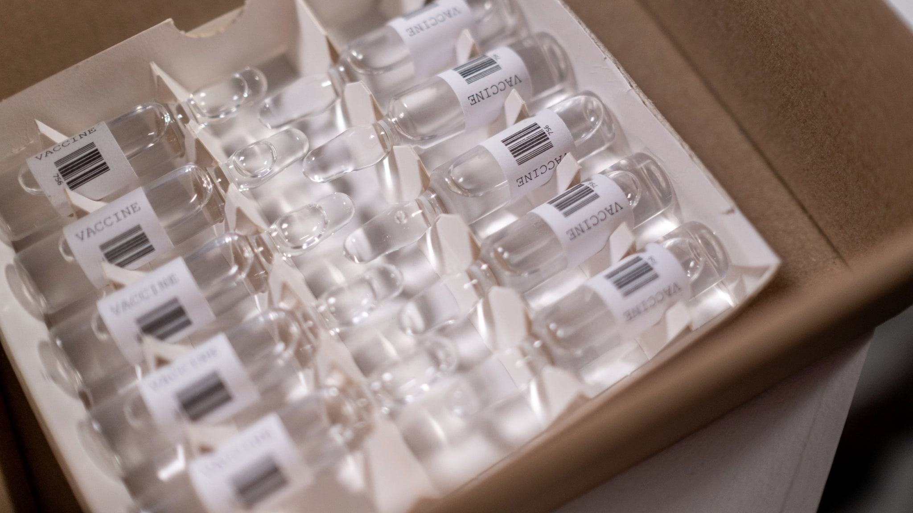
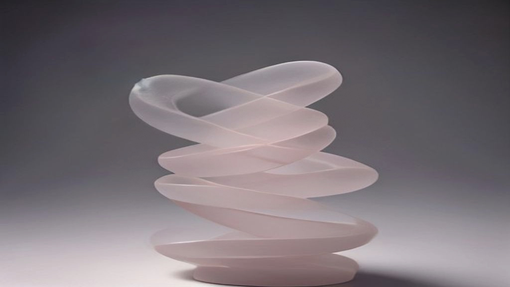

Zalm-DNA in een serum. Als marketingzin is het onweerstaanbaar: exotisch, biologisch, en net genoeg wetenschappelijk klinkend om vertrouwen te wekken. PDRN is in Koreaanse verzorgingsproducten in korte tijd van niets naar overal gegaan.

Dit artikel gaat over wat PDRN is, en vooral over een verschil dat in vrijwel elke productbeschrijving wegvalt: het verschil tussen waar het onderzoek over gaat en waar het potje over gaat.

## Wat PDRN is

PDRN staat voor polydeoxyribonucleotide. Het zijn fragmenten van DNA, ketens van de bouwstenen waaruit erfelijk materiaal bestaat, die zijn opgeknipt tot stukken van een bepaalde lengte.

De grondstof komt inderdaad van zalm. Een overzichtsartikel in *Pharmaceuticals* uit 2021 beschrijft PDRN als een van DNA afgeleid middel uit het zaad van regenboogforel of ketazalm, met een zuiverheid van ten minste 95 procent. De reden om vis te gebruiken is praktisch: het is ruim beschikbaar als restproduct, en DNA is tussen soorten chemisch sterk vergelijkbaar.

Het voorgestelde werkingsmechanisme in dat onderzoek loopt via de adenosine-A2A-receptor en via de zogeheten salvage pathway, een route waarlangs cellen bouwstenen hergebruiken in plaats van ze helemaal opnieuw te maken.

## Het punt dat er in productteksten uit valt

Hier komt de kern van dit artikel.

Datzelfde overzichtsartikel beschrijft PDRN als een **geneesmiddel**, en beschrijft klinisch onderzoek waarin het werd toegediend via injecties, in de spier of rond een wond, bijvoorbeeld vijf dagen per week in een vastgestelde dosering. Toepassing op de huid, in zalven of hydrogels, wordt beschreven als het meer experimentele deel van het onderzoek.

Dat is een fundamenteel verschil. Wat er gebeurt als een stof onder je huid wordt gebracht in een gedoseerde hoeveelheid, zegt vrijwel niets over wat er gebeurt als diezelfde stof in een serum op je huid wordt uitgestreken.

Er is een tweede horde, en die is fysiek. DNA-fragmenten zijn grote moleculen. De hoornlaag is er nu juist op gebouwd om grote moleculen buiten te houden. Een stof die zijn werk moet doen in levend weefsel, moet daar eerst zien te komen, en dat is precies de stap waar het onderzoek naar cosmetische toepassing nog het dunst is.

Dat maakt PDRN in een serum niet zinloos. Het maakt wel dat het onderzoek waarnaar merken verwijzen, over een andere toepassing gaat dan die zij verkopen.

## Wat er in Nederland wel en niet mag

In de EU bepaalt niet de stof maar de presentatie en de werking onder welk regime een product valt. Iets wat wordt aangeboden om een aandoening aan te pakken, is een geneesmiddel of medisch hulpmiddel, met bijbehorende toelatingseisen. Iets wat wordt aangeboden om te reinigen, te verzorgen of het uiterlijk te veranderen, is cosmetica onder Verordening (EG) nr. 1223/2009.

Voor PDRN loopt die grens dwars door het onderwerp heen. In een medische context worden polynucleotiden in Europa als injectie toegepast, onder toezicht en met een toelating. Diezelfde letters op een serum in een webshop vallen onder het cosmeticaregime, waar geen enkele medische werking geclaimd mag worden.

Als je dus een productpagina ziet die verwijst naar klinisch onderzoek met injecties om een crème aan te prijzen, gebeurt daar iets dat niet klopt, juridisch niet en inhoudelijk niet.

## Polynucleotiden, PN, PDRN: de namen

Je komt verschillende termen tegen die op elkaar lijken.

**PDRN** verwijst naar de opgeknipte DNA-fragmenten met een gedefinieerde lengteverdeling zoals hierboven beschreven.

**PN of polynucleotiden** is de bredere term, en wordt in de esthetische geneeskunde vaak gebruikt voor injecteerbare producten met langere ketens.

**Sodium DNA** is de INCI-naam die je op cosmetica-etiketten ziet. Dat is de naam die in de Europese ingrediëntenlijst hoort te staan; "PDRN" is een aanduiding die eerder in de marketing dan in de INCI-lijst thuishoort.

Die laatste is nuttig om te weten. Als een product PDRN groot op de voorkant zet maar op de ingrediëntenlijst helemaal geen Sodium DNA of vergelijkbaar bestanddeel noemt, is dat een reden om nog eens goed te kijken.

## Waarom het ineens overal zit

De snelheid waarmee PDRN in verzorgingsproducten opdook, heeft weinig met een nieuwe ontdekking te maken en veel met hoe de markt werkt.

In Zuid-Korea is de esthetische geneeskunde groot en zichtbaar. Behandelingen met injecteerbare polynucleotiden werden daar bekend onder een publiek dat gewend is producten en klinische procedures in één adem te bespreken. Zodra een term in de kliniek herkenbaar is geworden, is de stap naar een productlijn met dezelfde naam commercieel klein.

Wat daarbij gebeurt, is dat de bekendheid van de term wordt overgedragen op een ander product. De koper herkent de naam uit een context waarin er wél gecontroleerd bewijs bestaat, en neemt dat vertrouwen mee naar een potje waarvoor dat bewijs niet is geleverd. Dat is niet per se opzettelijke misleiding, maar het effect is hetzelfde.

Daar komt bij dat een gehalte op de verpakking weinig houvast biedt. Zonder informatie over de lengteverdeling van de fragmenten en over de zuiverheid zegt een percentage nauwelijks iets, twee producten met hetzelfde getal kunnen chemisch flink verschillen.

## Wat je hieruit kunt meenemen

- PDRN is een reële, goed beschreven stof met een onderzocht werkingsmechanisme.
- Het klinische onderzoek gaat overwegend over injecties in een medische context, niet over cosmetisch gebruik op de huid.
- De doorlaatbaarheid van de hoornlaag voor grote moleculen is een openstaande vraag bij cosmetische toepassing, geen opgelost probleem.
- Op cosmetica mag geen medische werking geclaimd worden, ongeacht wat er over de stof gepubliceerd is.
- Op het etiket zoek je naar de INCI-naam, niet naar de marketingafkorting.

Wie dit ingrediënt interessant vindt, doet er goed aan te onthouden waar het bewijs vandaan komt. Dat is niet hetzelfde als zeggen dat het niets doet, het is zeggen dat de vraag of het in deze vorm iets doet, nog grotendeels open is.
