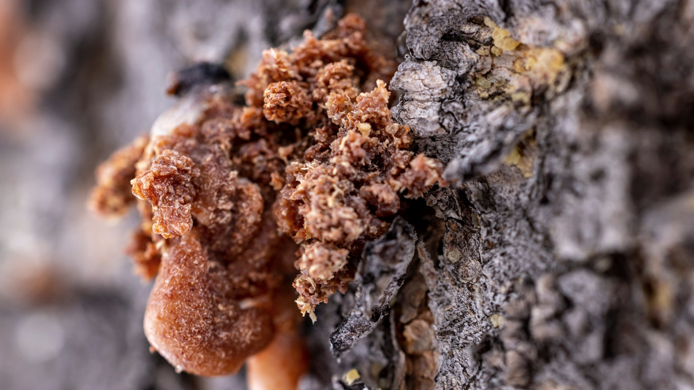
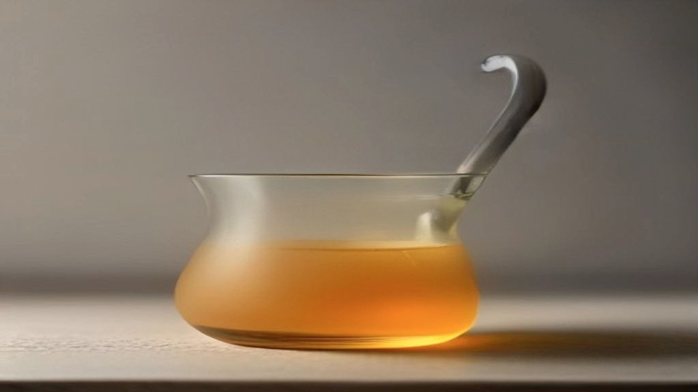

Propolis is het bruine, kleverige spul waarmee bijen de kieren van hun kast dichtsmeren. In het Nederlands heet het bijenlijm, en dat dekt de lading: het is bouwmateriaal, geen honing. In Koreaanse verzorgingsproducten is het de afgelopen jaren opgedoken in ampullen, essences en maskers, meestal met een gouden kleur en een belofte over glans.

Wat propolis interessant maakt, is ook precies wat het lastig maakt: het is geen stof, maar een mengsel dat per kast verschilt.

## Waar het vandaan komt

Bijen verzamelen hars van knoppen, schors en wondplekken van bomen. Die hars mengen ze met was en met eigen afscheidingen. Het resultaat gebruiken ze om hun kast luchtdicht te maken, om oneffenheden glad te strijken en om binnendringers die te groot zijn om weg te slepen af te dekken.

Het is dus geen product dat bijen maken om te eten of om af te staan, maar een bouwstof met een functie in de kast zelf.

## Wat erin zit

Een overzichtsartikel in de *Saudi Journal of Biological Sciences* uit 2019 vat de samenstelling samen. Er zijn ruim driehonderd verschillende verbindingen in propolis geïdentificeerd: fenolische verbindingen, aromatische zuren, etherische oliën, wassen en aminozuren. De groepen die in dat onderzoek de meeste aandacht krijgen, zijn de flavonoïden en de fenolzuren.

En dan volgt het punt dat het hele ingrediënt kenmerkt. Diezelfde review stelt vast dat de eigenschappen van propolis afhangen van de chemische samenstelling, en dat die samenstelling wisselt met de plantenbron, de geografische streek en het seizoen van verzamelen.

Lees dat nog eens. De samenstelling hangt af van welke bomen er in de buurt van de kast stonden, in welk land die kast stond, en in welke maand er geoogst is.

## Waarom dat meer uitmaakt dan bij andere ingrediënten

Bij de meeste ingrediënten in een verzorgingsproduct weet je wat je hebt. Niacinamide is niacinamide, waar het ook vandaan komt. Hyaluronzuur verschilt in molecuulgrootte, maar het is een gedefinieerde stof.

Propolis niet. Twee producten die allebei "propolis" op het etiket hebben staan, kunnen mengsels bevatten die chemisch aanzienlijk van elkaar verschillen. Braziliaanse groene propolis heeft een ander profiel dan Europese populierpropolis. Zelfs binnen één streek verschilt een voorjaarsoogst van een najaarsoogst.

Voor een fabrikant is dat een uitdaging. Voor jou als lezer betekent het iets eenvoudigers: onderzoek dat is gedaan met één specifieke propolis zegt beperkt iets over het potje dat jij in handen hebt, tenzij er precies staat om welke soort en welk gehalte het gaat. Dat staat er zelden.

## Wat er niet gezegd mag worden

De vakliteratuur over propolis staat vol met farmacologische termen. De review uit 2019 noemt een lange reeks onderzochte eigenschappen, van antioxidatief tot antibacterieel en ontstekingsgerelateerd.

Hier is het belangrijk om scherp te zijn, en dit is meteen de reden dat die term in dit artikel überhaupt valt: **zulke werkingen mogen niet als claim op een cosmetisch product staan.** Verordening (EG) nr. 1223/2009 en de bijbehorende criteria trekken een harde grens tussen cosmetica en geneesmiddelen. Een verzorgingsproduct verzorgt, reinigt, parfumeert of verandert het uiterlijk — het mag geen aandoening aanpakken en geen medische werking claimen.

Onderzoek naar wat een stof in een laboratorium doet, is dus iets anders dan wat een crème mag beweren. Dat is geen slordigheid in de regelgeving maar de kern ervan: zodra een product een medische werking claimt, valt het onder een heel ander en veel strenger regime, met de bijbehorende bewijslast.

Als je op een verkooppagina toch zulke bewoordingen tegenkomt, weet je dus twee dingen: het mag niet, en de verkoper heeft ofwel de regels niet gelezen ofwel besloten ze te negeren.

## Waar je op kunt letten

Zonder aanbevelingen te doen, zijn er een paar dingen die je zelf kunt nagaan op een etiket of productpagina.

**Staat de herkomst erbij?** Land, en liefst plantenbron. Als een merk moeite doet om te vermelden dat het om een specifieke soort gaat, weet het merk in elk geval waar het over praat.

**Staat er een gehalte?** "Bevat propolis" kan alles betekenen tussen een royale hoeveelheid en een symbolische druppel. Sommige Koreaanse merken vermelden een percentage propolis-extract, wat aanzienlijk informatiever is.

**Waar staat het in de INCI-lijst?** Ingrediënten worden in aflopende volgorde van gehalte vermeld tot 1 procent. Staat propolis achteraan tussen de conserveermiddelen en de geurstoffen, dan zit er weinig in.

**Ben je gevoelig voor bijenproducten?** Propolis is een bekende oorzaak van contactallergie. Dat is geen reden voor paniek, maar wel een reden om een nieuw product niet meteen over je hele gezicht te smeren. Wie weet allergisch te zijn voor bijenproducten, kan dit ingrediënt beter overslaan.

## Samengevat

Propolis is een natuurlijk mengsel met een lange gebruiksgeschiedenis en een breed onderzocht chemisch profiel. Het is ook het ingrediënt waarbij de afstand tussen "wat is er onderzocht" en "wat zit er in dit potje" het grootst is, simpelweg omdat de grondstof zelf niet constant is.

Dat maakt het niet minder interessant. Het maakt wel dat elke stellige belofte erover met meer zekerheid wordt uitgesproken dan de grondstof toelaat.
