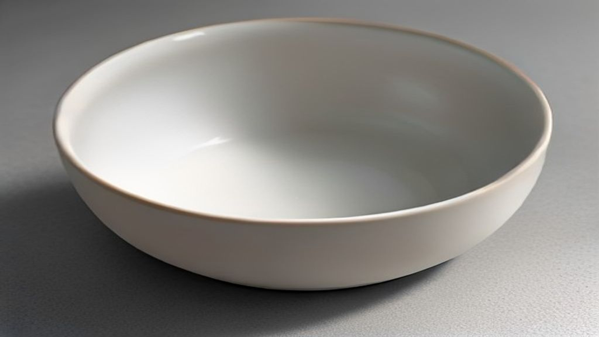
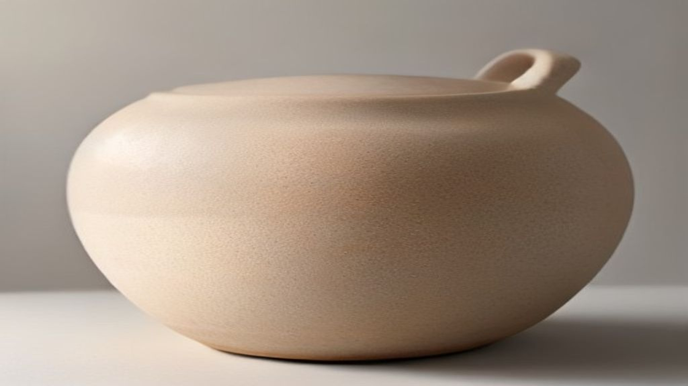

Rijstwater bewaren om je gezicht mee te wassen is geen uitvinding van een marketingafdeling. Het is een gebruik dat in verschillende Aziatische landen al generaties bestaat, meestal als vanzelfsprekend gevolg van het feit dat er toch rijst gewassen werd en er dus toch water overbleef.

Dat het inmiddels in ampullen van dertig milliliter zit, met een prijskaartje, is wel nieuw. Dit artikel gaat over wat er in rijstextract zit en hoe stevig het onderzoek is dat er doorgaans bij wordt aangehaald.

## Wat er in de korrel zit

Een rijstkorrel is niet één ding. De buitenste laag — de zemel — is de rijkste laag qua stoffen, en het is precies de laag die bij het maken van witte rijst wordt weggeslepen.

In die zemel zitten onder meer vitaminen uit de B-groep, mineralen, oliën met onverzadigde vetzuren, en een reeks plantstoffen waaronder ferulazuur en gamma-oryzanol. Daarnaast bevat rijst zetmeel, dat in water een lichte, matterende film achterlaat — vermoedelijk de reden dat het traditionele gebruik als verzorgend werd ervaren.

Op etiketten kom je verschillende varianten tegen. *Oryza Sativa Extract* is een extract van de plant; *Oryza Sativa Bran Extract* specifiek van de zemel; en gefermenteerde varianten dragen namen die op de gebruikte schimmel of gist wijzen.

## Waarom fermentatie zo vaak terugkomt

Bij Koreaanse producten zie je opvallend vaak een gefermenteerde vorm. Daar zit een logica achter die verder gaat dan het woord op de verpakking.

Fermenteren betekent dat je micro-organismen op de grondstof loslaat. Die breken grotere moleculen af tot kleinere, en produceren onderweg stoffen die er eerst niet waren. Het resultaat is een ander mengsel dan waarmee je begon: doorgaans kleinere moleculen, en soms stoffen die beter oplossen of stabieler zijn.

Voor huidverzorging is het argument meestal dat kleinere moleculen makkelijker door de hoornlaag komen. Dat argument is plausibel maar niet automatisch waar: molecuulgrootte is één factor naast oplosbaarheid, lading en de formulering waarin de stof zit.

De historische link met sake — rijstwijn — is hier geen toeval. Het waarnemen dat brouwers opvallend gladde handen hadden, is een van de vaakst herhaalde oorsprongsverhalen in de Aziatische cosmetica. Als waarneming is het aardig; als bewijs is het niets. Mensen die de hele dag met hun handen in vloeistof zitten, verschillen op meer manieren van de rest.

## Het onderzoek, en hoe je het moet lezen

Het overzichtsartikel dat het vaakst wordt aangehaald, verscheen in 2022 in het *Journal of Cosmetic Dermatology*, onder de veelzeggende titel "Dermatological uses of rice products: Trend or true?" — trend of waar?

De auteurs concluderen dat uit rijst geïsoleerde ingrediënten brede mogelijkheden hebben in huidverzorging en cosmetica. Ze noemen een reeks onderzochte eigenschappen en stellen dat rijstderivaten veilig, niet-irriterend en weinig allergeen zijn.

Nu de kanttekening, en die is belangrijk genoeg om apart te zetten. Dit is een literatuuroverzicht, geen origineel onderzoek: de auteurs hebben bestaande publicaties verzameld en samengevat. In dat overzicht worden de bevindingen overwegend positief gepresenteerd, zonder kritische weging van de kwaliteit van de onderliggende studies. Er staat niet bij hoe groot die studies waren, hoe ze waren opgezet, of hoe betrouwbaar de gebruikte maatstaven waren.

Dat maakt de review niet waardeloos — als landkaart van wat er onderzocht is, is hij prima. Het maakt wel dat "onderzoek toont aan" hier een zwaardere lading krijgt dan de bron draagt. Wie de conclusies overneemt zonder die weging, geeft ze meer gewicht dan de auteurs zelf hebben onderbouwd.

## Wat een cosmetisch product hierover mag zeggen

Verordening (EG) nr. 1223/2009 begrenst wat een verzorgingsproduct mag beweren. Reinigen, parfumeren, het uiterlijk veranderen, beschermen, in goede staat houden: dat mag. Een aandoening aanpakken of een medische werking claimen: dat mag niet.

Bij rijstextract is dat relevant omdat sommige aangehaalde onderzoekseigenschappen in de medische hoek liggen. Zulke bevindingen mogen wel beschreven worden in een artikel als dit — als samenvatting van onderzoek — maar ze mogen niet als belofte op een product staan.

Het verschil zit hem in de rol: uitleggen wat er onderzocht is, is iets anders dan aanprijzen wat een potje gaat doen.

## Wat je op een etiket kunt nagaan

**Welke variant?** Zemelextract, plantextract of een gefermenteerde vorm zijn niet hetzelfde, ook al staat er "rijst" bij.

**Waar in de lijst?** Sommige Koreaanse producten zetten rijstextract vooraan, soms zelfs als eerste ingrediënt in plaats van water. Dat is een merkbaar andere formule dan een product waar het achteraan staat.

**Wat zit eromheen?** Rijstextract komt vaak samen met niacinamide of met andere fermenten. Wat je aan zo'n product toeschrijft, kan net zo goed van de rest van de formule komen.

**Rijstolie of rijstextract?** Rijstzemelolie is een olie met een eigen vettig karakter; een waterig extract gedraagt zich totaal anders in een formule.

## Samengevat

Rijstextract is een ingrediënt met een echte gebruiksgeschiedenis, een aannemelijke samenstelling en een groeiend maar nog niet streng gewogen onderzoeksdossier. Het overzicht dat er het vaakst bij wordt gehaald, vraagt in zijn eigen titel of het trend of waarheid is — en beantwoordt die vraag minder stellig dan de productteksten die eruit citeren.
